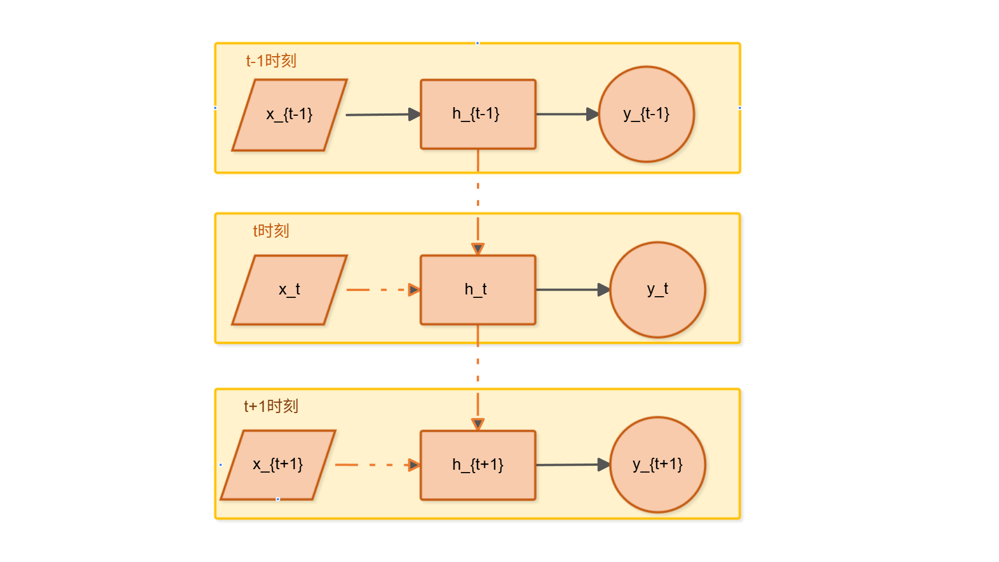
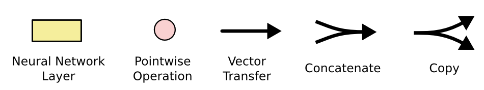
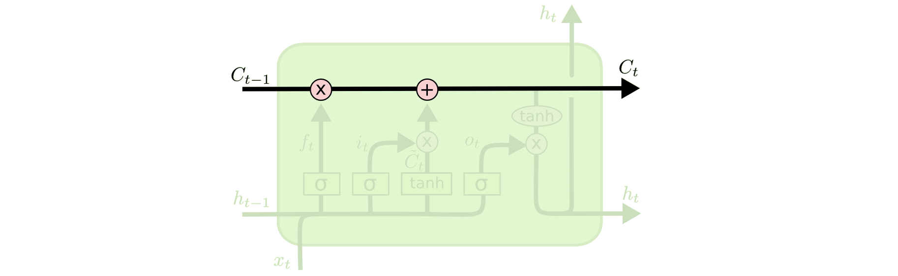
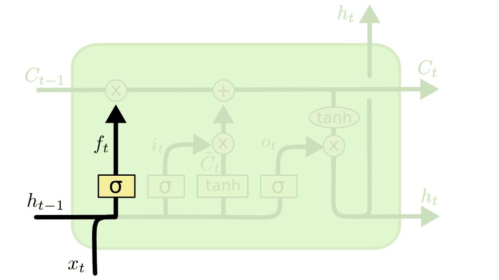
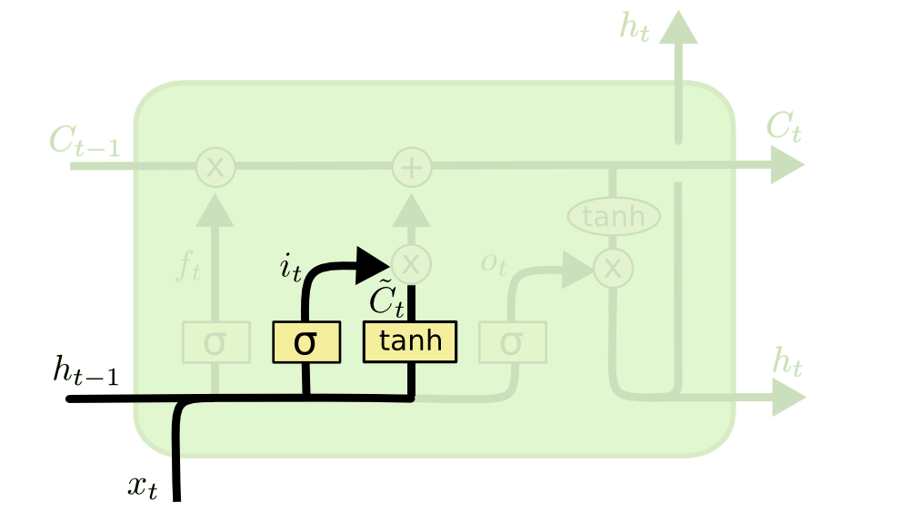
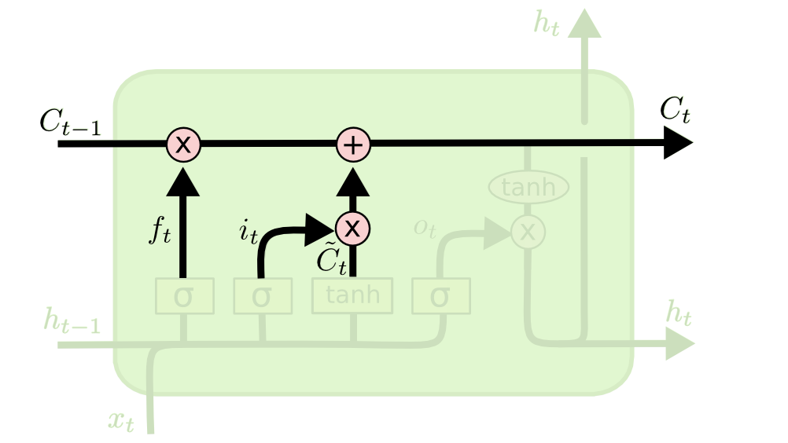
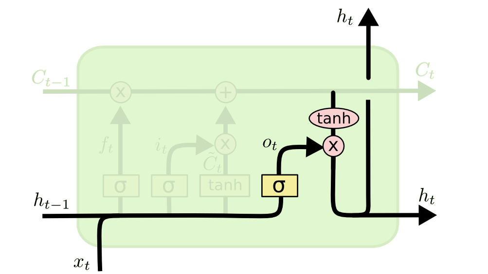
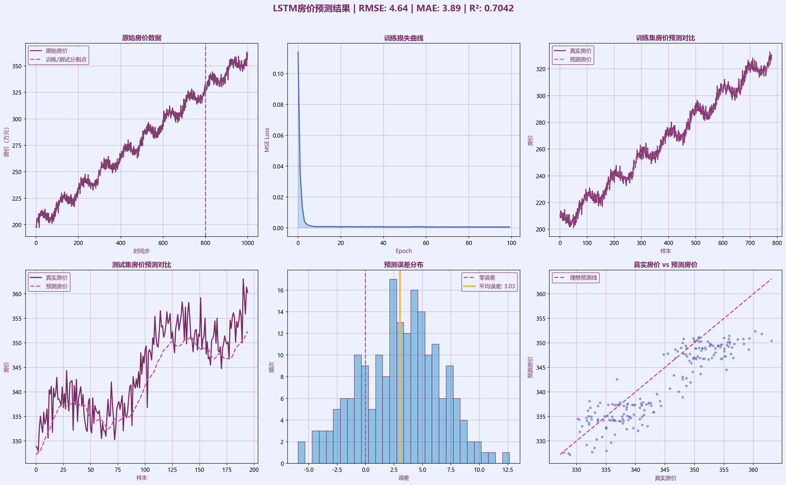

## LSTM 长短期记忆神经网络学习笔记[^1] 
---     
---
### 起源 
***LSTM（ Long Short-Term Memory）长短期记忆神经网络***，由Hochreiter和Schmidhuber于1997年在论文```《Long Short-Term Memory》``` [^2]中提出。  
作为***RNN（传统循环神经网络）*** 的升级版，解决了传统神经网络的一些痛处。    
  
---  
### 优势和不足  
**优势：**  
- **1.** 能够解决传统神经网络RNN的长序列依赖问题。  
&emsp;标准的RNN只能记住短距离信息，长序列会出现梯度消失问题。但是LSTM借助细胞状态（Cell State）能有效学习长距离依赖关系。  
- **2.** 通过门控机制，自行决定哪些信息需要记忆、哪些信息需要遗忘，不需要人工进行规划。  
- **3.** LSTM结构简单直观，梯度更加稳定，比原生 RNN 更容易收敛。  
   
**不足：**  
- **1.** 和标准RNN一样，LSTM也是串行计算的，计算第$t$步时依赖第$t-1$步的隐藏状态，必须按照时间步一步一步计算。而且也不能利用关联全局任意时间步的信息。
- **2.** 参数量大，这导致计算量大，并且调参成本高，调整隐藏层维度、学习率、序列长度、batch size等参数都会对结果产生未知影响。  
- **3.** 虽然LSTM是能解决标准RNN的·长序列依赖问题，但是只是**缓解**而非彻底解决长依赖，序列极长时（比如上千时间步）仍然会丢失信息。  
   
---
### 使用边界 
当场景满足以下条件时，LSTM 是一个不错的选择：  
- 给出数据是时序或者序列类型，比如时间序列预测、短文本或者语音信号处理。  
- 序列长度中等，不会太长也不会太短。  
- 不需要用到未来时间步信息，只需要实时和过去时间步信息。  

常见的场景有：  
- 工业传感器的时序预测  
- 股票价格/房价、天气、销量的预测  
- 实时语音信号处理      
        
不能用于以下场景：  
- 需要高速训练的大规模数据，这会导致训练成本爆炸  
- 计算机视觉相关。此时更适合CNN或Transformer，如果非要用，可以尝试CNN提取特征，LSTM再进行时序建模。  
- 需要双向语义理解（同时需要看过去和未来步的信息）的场景。此时需要用BiLSTM或者其他模型算法。  
  
---  
### 引入  
我们知道，**LSTM**作为**RNN**的升级版，解决了传统神经网络无法处理时序依赖、长序列数据的问题。那么我么先来简单了解一下**RNN**。  
RNN是一类循环神经网络模型的综合体，它通过在每个时间步引入循环连接，能够有效地处理时序依赖关系。简单来说，就是在预测推理下一个步输出时，需要考虑到之前所有步的输入和输出。  
      
> 图1 RNN结构[^3]
     
- $$  
h_t = \sigma\left(W_{xh}x_t + W_{hh}h_{t-1} + b_h\right) \\
y_t = \sigma\left(W_{hy}h_t + b_y\right)
$$      

**其中：**    
- **$h_t$** 为第 $t$ 个时间步的隐藏状态向量,RNN的记忆。  
- **$y_t$** 为第 $t$ 个时间步的输出向量。  
- **$\sigma$** 为激活函数，比如常用的```sigmoid函数```和```tanh函数```。  
- **$W_{xh}$** 为输入到隐藏状态的权重矩阵，**$W_{hh}$** 为隐藏状态到隐藏状态的权重矩阵，**$W_{hy}$** 为隐藏状态到输出的权重矩阵。  
- **$b_h$** 为隐藏状态的偏置项，**$b_y$** 为输出的偏置项。    
    
**优点：**  
- 理论上，能够处理任意长度的序列数据。  
- 天然利用时序/顺序进行串行运算。  

**出现的问题：**    
- **1.** 在反向传播时，梯度会随时间步长指数级衰减或放大，出现```梯度消失/爆炸```问题，导致模型无法学习长距离依赖。比如预测第 100 步时，反而记不住第1步的关键信息，这也是 RNN 难以处理长序列的根本原因。
- **2.** 核⼼计算逻辑是时序依赖的串⾏计算，第$t$步的隐藏状态必须根据第$t-1$步的隐藏状态和当前的输⼊来计算才能得到，⽆法跳过前序步骤直接计算后续状态。  
  
---  
### 梯度消失/爆炸    
**前向传播：**    

上述引入中的公式：  
> - 隐藏状态更新：$h_t = \sigma\left(W_{xh}x_t + W_{hh}h_{t-1} + b_h\right)$  
> - 输出计算：$y_t = \sigma\left(W_{hy}h_t + b_y\right)$    

以及损失计算：   
> - 单个时间步损失：$L_t = -\sum \text{标签向量} \cdot \log\left(\text{softmax}(y_t)\right)$  
> - 所有时间步的总损失：$L = \sum_{t=1}^{T} L_t$     
  
这整个过程统称为**前向传播**。  
为了让模型的预测更准确，损失值更小，在每一轮训练中，需要通过**反向传播**来计算梯度，并使用优化算法**梯度下降**来更新模型参数。    
以参数$M$为例，梯度下降参数更新的公式为：   
$$
M_{new} = M_{old} - \eta \cdot \frac{\partial L}{\partial M}  
$$  
- $\frac{\partial L}{\partial M} $是损失函数关于参数M的梯度,$\eta$是学习率步长  
- 假如梯度>0为正，参数增加损失上升，则$M_{new}$ =$M_{old}$ - 正数，参数减小，损失函数值下降。   
- 假如梯度<0为负，参数增加损失下降，则$M_{new}$ =$M_{old}$ + 负数，参数增大，损失函数值下降。    
  
当在反向传播时，每经过一层，乘以小于1的数，比如权重矩阵特征值小于1、激活函数的导数小于1，梯度就会变小，最后的几层梯度几乎为0，而最前面几层完全不更新，此时就为**梯度消失**。  
反之，梯度不断乘上大于1的数，导致梯度指数级增长，这时发生**梯度爆炸**。模型参数会溢出，损失函数剧烈震荡，无法收敛，导致训练不稳定甚至崩溃。  

为了解决**梯度消失/爆炸问题**，即 RNN 难以处理长序列的根本问题，提出了**LSTM**模型。
  
---  
### LSTM的结构特点：  
首先，将**RNN**和**LSTM**的核心重复结构进行对比。  
   
> 图2[^4]：标准RNN结构，和图1[^2]是一个意思。   

  
> 图3[^5]：LSTM核心结构  
  
从两幅图的对比可以发现，和一个标准RNN的单层结构相比，LSTM核心多了三个相互作用层（也有人说是四个，其实没区别），下面按运行流程对其进行一一讲解。   
在开始前先说明一下图3中的各个符号所代表的意思：    
- 每一条线/单箭头(Vector Transfer)：一个完整的向量做直接传递，不做任何运算。  
- 线条合并/双箭头合并(Concatenate)：表示将两个向量按元素首位拼接成为一个新的向量。  
   - 例如：将$a = [1,2]$和$b = [3,4]$拼接，得到$c = [1,2,3,4]$  
- 单线条/单箭头分叉(Copy)：将一个向量进行复制，传送到不同节点。   
- 黄色方框(Neural Network Layer):表示一个可学习的神经网络层，即隐藏层。由一个全连接层和一个激活函数组成。全连接层用于线形变换，激活函数用于做非线性变换。  
- 粉色圆(Pointwise Operation):维度相同的向量进行逐点运算。  
   - 如果圈内是+号，代表向量逐元素相加。  
   - 如果圈内是$\otimes$号，代表向量逐元素相乘。  
  

> 图4[^6]：LSTM符号说明
  
**细胞状态（Cell State）**  
细胞状态是LSTM的核心，它贯穿整个LSTM重复模块，类似于RNN中的隐藏状态$h_t$。   
其核心作用是在序列中持续传递，进行长期记忆。这种可控并且持久的记忆，类似于细胞遗传物质一样稳定，所以被称为**Cell State**  
  
> 图5[^7]:细胞状态   

它的更新公式为：
- $$
C_t = f_t \otimes C_{t-1} + i_t \otimes \sigma(C_{t-1})
$$
- 其中，$f_t$、$i_t$是遗忘门和输入门的输出向量，$\sigma$是sigmoid函数，$C_{t-1}$是上一个时间步的细胞状态，$C_t$是当前时间步的细胞状态。  
- $C_t$可以理解为当前存储的记忆，而$h_t$是当前对外展示的一个窗口。    
    
**遗忘门（Forget Gate）**    
这个部分类似于人脑的记忆机制，过滤遗忘掉一些没有用的信息。  
    
> 图6[^8]:遗忘门
  
公式：  
- $$
f_t = \sigma\left(W_f \cdot [h_{t-1}, x_t] + b_f\right)
$$     

其输出$f_t$是一个所有元素值在(0,1)的向量，$f_t$的第$i$个元素，表示在细胞状态$C_{t-1}$的第$i$个元素需要保留的比例。最终决定是否遗忘或保留的是$C_{t-1}$和$f_t$的逐点相乘结果（即逐元素相乘）。  
- 当$f_t$的第$i$个元素接近0时，说明在细胞状态$C_{t-1}$的第$i$个元素需要被遗忘。  
- 当$f_t$的第$i$个元素接近1时，说明在细胞状态$C_{t-1}$的第$i$个元素需要被保留。  
  
**输入门（Input Gate）**    
用于决定哪些新的信息需要被添加到细胞状态中。  
  
> 图7[^9]:输入门第一个操作  
  

> 图8[^10]:输入门第二个操作。有人将这个操作称为**更新门**。  
  
核心公式：  
- $$
i_t = \sigma\left(W_i \cdot [h_{t-1}, x_t] + b_i\right) \\
\tilde{C}_t = \tanh\left(W_C \cdot [h_{t-1}, x_t] + b_C\right) \\  
C_t = f_t \odot C_{t-1} + i_t \odot \tilde{C}_t
$$
- $i_t$也是一个所有元素值在(0,1)的向量，和遗忘门中的$f_t$作用类似，与$\tilde{C}_t$逐点相乘，决定哪些新的信息需要被添加到细胞状态中。  
- $\tilde{C}_t$是一个所有元素值在(-1,1)的向量，作为新的记忆候选内容。
- $C_t$是继$C_{t-1}$后新的存储的记忆。  
- 最终$f_t \odot C_{t-1}$决定哪些记忆需要被遗忘，$i_t \odot \tilde{C}_t$决定哪些新的记忆需要被添加。  
  
**输出门（Output Gate）**  
我们最后只需要决定要输出什么。基于当前的细胞状态$C_t$，进行一个筛选，决定输出哪一部分。  
  
> 图9[^11]:输出门  

核心公式：  
- $$
o_t = \sigma\left(W_o \cdot [h_{t-1}, x_t] + b_o\right) \\
h_t = o_t \odot \tanh(C_t)
$$
- $o_t$是一个所有元素值在(0,1)的向量，决定细胞状态$C_t$中哪些部分需要被输出。  
- $\tanh(C_t)$是一个所有元素值在(-1,1)的向量，作为当前时间步的隐藏状态。  
- $h_t$是当前对外展示的一个窗口，也就是最终的输出门输出，只展示$o_t$筛选后的部分。  
    
其中:  
- $$
\tanh(x) = \frac{e^{x} - e^{-x}}{e^{x} + e^{-x}}
$$  

函数$tanh(x)$的输出范围为(-1,1),而$C_t$的值是不断累积的，后续值可能会越来越大，或者越来越小，导致后续数值爆炸等问题，所以利用$tanh(x)$的输出范围为(-1,1)的特性，将$C_t$的值限制在(-1,1)范围内。并且也可以和同样为$tanh(x)$函数输出的$\tilde{C}_t$和$h_{t-1}$匹配数值范围。
  
### 应用实例  
**下面以房价预测为例，搭建一个模型:**  
```Python  
# =============================================================================
# 第一部分：导入必要的库
# =============================================================================
import numpy as np                              # 数值计算库，用于数据处理
import torch                                    # PyTorch深度学习框架
import torch.nn as nn                           # 神经网络模块，包含LSTM等层
import matplotlib.pyplot as plt                 # 绘图库，用于结果可视化
from sklearn.preprocessing import MinMaxScaler  # 数据归一化工具
from sklearn.metrics import mean_squared_error, mean_absolute_error, r2_score  # 评估指标

# -----------------------------------------------------------------------------
# 设置matplotlib中文显示
# -----------------------------------------------------------------------------
plt.rcParams['font.sans-serif'] = ['Microsoft YaHei']
plt.rcParams['axes.unicode_minus'] = False  # 解决负号显示问题

# =============================================================================
# 第二部分：数据准备 —— 自主生成模拟房价时间序列数据
# =============================================================================

def generate_house_price_data(n_samples=1000):
    """
    生成模拟房价数据（仿照股票生成逻辑，符合真实房价趋势）
    
    房价通常包含：
    1. 长期上涨趋势（城市化、通胀）
    2. 周期性波动（房地产周期）
    3. 随机波动（市场情绪）
    
    参数：
        n_samples: 时间步数量
    
    返回：
        price: 房价序列
    """
    # 时间轴
    t = np.linspace(0, 20, n_samples)
    
    # 房价生成公式（完全仿照股票格式）
    # 基础价 + 逐年上涨 + 周期波动 + 随机噪声
    price = 200 + 8*t + 6*np.sin(2 * np.pi * t / 2.0) + 3*np.random.randn(n_samples)
    
    # 确保房价不为负
    price = np.maximum(price, 100)
    
    return price

# 生成1000个时间步的模拟房价数据
prices = generate_house_price_data(1000)
print(f"生成房价数据形状: {prices.shape}")

# -----------------------------------------------------------------------------
# 数据归一化
# -----------------------------------------------------------------------------
scaler = MinMaxScaler(feature_range=(0, 1))
prices_scaled = scaler.fit_transform(prices.reshape(-1, 1))
print(f"归一化后数据范围: [{prices_scaled.min():.4f}, {prices_scaled.max():.4f}]")

# -----------------------------------------------------------------------------
# 滑动窗口构建监督学习数据集
# -----------------------------------------------------------------------------
def create_dataset(data, seq_length):
    X, y = [], []
    for i in range(len(data) - seq_length):
        X.append(data[i:i+seq_length])
        y.append(data[i+seq_length])
    return np.array(X), np.array(y)

# 用过去25个时间步的房价，预测下一个时间步的房价
SEQ_LENGTH = 25
X, y = create_dataset(prices_scaled, SEQ_LENGTH)

print(f"总样本数: {len(X)}")
print(f"输入X形状: {X.shape}")
print(f"输出y形状: {y.shape}")

# -----------------------------------------------------------------------------
# 划分训练集 / 测试集（时间序列不能打乱）
# -----------------------------------------------------------------------------
train_size = int(len(X) * 0.8)

X_train = torch.FloatTensor(X[:train_size])
y_train = torch.FloatTensor(y[:train_size])
X_test = torch.FloatTensor(X[train_size:])
y_test = torch.FloatTensor(y[train_size:])

print(f"\n数据集划分:")
print(f"  训练集: {X_train.shape}")
print(f"  测试集: {X_test.shape}")

# =============================================================================
# 第三部分：LSTM模型定义
# =============================================================================
class LSTMModel(nn.Module):
    def __init__(self, input_size=1, hidden_size=64, num_layers=2, output_size=1):
        super(LSTMModel, self).__init__()
        self.lstm = nn.LSTM(
            input_size=input_size,
            hidden_size=hidden_size,
            num_layers=num_layers,
            batch_first=True,
            dropout=0.2
        )
        self.fc = nn.Linear(hidden_size, output_size)

    def forward(self, x):
        lstm_out, (h_n, c_n) = self.lstm(x)
        last_output = lstm_out[:, -1, :]
        output = self.fc(last_output)
        return output

# 实例化模型
model = LSTMModel(
    input_size=1,
    hidden_size=64,
    num_layers=2,
    output_size=1
)

print(f"\n模型结构:")
print(model)
print(f"模型参数总数: {sum(p.numel() for p in model.parameters()):,}")

# =============================================================================
# 第四部分：模型训练
# =============================================================================
criterion = nn.MSELoss()
optimizer = torch.optim.Adam(model.parameters(), lr=0.001)

batch_size = 32
train_dataset = torch.utils.data.TensorDataset(X_train, y_train)
train_loader = torch.utils.data.DataLoader(
    train_dataset,
    batch_size=batch_size,
    shuffle=True
)

num_epochs = 100
train_losses = []

print(f"\n开始训练房价预测模型.")

for epoch in range(num_epochs):
    model.train()
    epoch_loss = 0

    for batch_X, batch_y in train_loader:
        optimizer.zero_grad()
        predictions = model(batch_X)
        loss = criterion(predictions, batch_y)
        loss.backward()
        optimizer.step()
        epoch_loss += loss.item()

    avg_loss = epoch_loss / len(train_loader)
    train_losses.append(avg_loss)

    if (epoch + 1) % 20 == 0:
        print(f"  Epoch [{epoch+1}/{num_epochs}], Loss: {avg_loss:.6f}")

print("训练完成。")

# =============================================================================
# 第五部分：模型预测
# =============================================================================
model.eval()
with torch.no_grad():
    train_pred = model(X_train)
    test_pred = model(X_test)

# 反归一化
train_pred = scaler.inverse_transform(train_pred.numpy())
y_train_actual = scaler.inverse_transform(y_train.numpy())
test_pred = scaler.inverse_transform(test_pred.numpy())
y_test_actual = scaler.inverse_transform(y_test.numpy())

print(f"\n房价预测完成。")

# =============================================================================
# 第六部分：模型评估与可视化
# =============================================================================
mse = mean_squared_error(y_test_actual, test_pred)
rmse = np.sqrt(mse)
mae = mean_absolute_error(y_test_actual, test_pred)
r2 = r2_score(y_test_actual, test_pred)

# =============================================================================
# 第七部分：可视化 —— 原神哥伦比娅配色
# 配色方案：
# 深紫: #772963 (R:119, G:41, B:93)
# 玫红: #C34FA7 (R:195, G:79, B:162)
# 浅白: #EDF1FD (R:237, G:241, B:253)
# 天蓝: #77B7E0 (R:119, G:183, B:240)
# 深蓝: #5364C0 (R:83, G:100, B:192)
# 高亮黄: #F5B841
# =============================================================================

# 定义最终配色常量
COLOR_MAIN = '#772963'       # 深紫（主色：真实数据、标题）
COLOR_ACCENT = '#C34FA7'     # 玫红（强调：预测数据、分割线）
COLOR_LIGHT = '#EDF1FD'      # 浅白（背景）
COLOR_AUX1 = '#77B7E0'      # 天蓝（辅助：直方图、填充）
COLOR_AUX2 = '#5364C0'      # 深蓝（辅助：散点、损失曲线）
COLOR_HIGHLIGHT = '#F5B841'  # 高亮黄（平均误差线）

# 创建画布
fig = plt.figure(figsize=(20, 12), facecolor=COLOR_LIGHT)

# 子图1：原始房价数据
ax1 = fig.add_subplot(2, 3, 1)
ax1.plot(prices, color=COLOR_MAIN, linewidth=2, alpha=0.9, label='原始房价')
ax1.set_title('原始房价数据', fontsize=12, fontweight='bold', color=COLOR_MAIN)
ax1.set_xlabel('时间步', color=COLOR_MAIN)
ax1.set_ylabel('房价（万元）', color=COLOR_MAIN)
ax1.grid(True, alpha=0.3, color=COLOR_MAIN, linestyle='-')
ax1.axvline(x=len(prices)*0.8, color=COLOR_ACCENT, linestyle='--', linewidth=2, label='训练/测试分割点')
ax1.legend(labelcolor=COLOR_MAIN, facecolor=COLOR_LIGHT, edgecolor=COLOR_MAIN)
ax1.set_facecolor(COLOR_LIGHT)

# 子图2：训练损失曲线
ax2 = fig.add_subplot(2, 3, 2)
ax2.plot(train_losses, color=COLOR_AUX2, linewidth=2, label='训练损失')
ax2.fill_between(range(len(train_losses)), train_losses, alpha=0.4, color=COLOR_AUX1)
ax2.set_title('训练损失曲线', fontsize=12, fontweight='bold', color=COLOR_MAIN)
ax2.set_xlabel('Epoch', color=COLOR_MAIN)
ax2.set_ylabel('MSE Loss', color=COLOR_MAIN)
ax2.grid(True, alpha=0.3, color=COLOR_MAIN)
ax2.set_facecolor(COLOR_LIGHT)

# 子图3：训练集房价预测对比
ax3 = fig.add_subplot(2, 3, 3)
ax3.plot(y_train_actual, color=COLOR_MAIN, linewidth=2, alpha=0.9, label='真实房价')
ax3.plot(train_pred, color=COLOR_ACCENT, linestyle='--', linewidth=2, alpha=0.8, label='预测房价')
ax3.set_title('训练集房价预测对比', fontsize=12, fontweight='bold', color=COLOR_MAIN)
ax3.set_xlabel('样本', color=COLOR_MAIN)
ax3.set_ylabel('房价', color=COLOR_MAIN)
ax3.legend(labelcolor=COLOR_MAIN, facecolor=COLOR_LIGHT, edgecolor=COLOR_MAIN)
ax3.grid(True, alpha=0.3, color=COLOR_MAIN)
ax3.set_facecolor(COLOR_LIGHT)

# 子图4：测试集房价预测对比
ax4 = fig.add_subplot(2, 3, 4)
ax4.plot(y_test_actual, color=COLOR_MAIN, linewidth=2, label='真实房价')
ax4.plot(test_pred, color=COLOR_ACCENT, linestyle='--', linewidth=2, label='预测房价')
ax4.set_title('测试集房价预测对比', fontsize=12, fontweight='bold', color=COLOR_MAIN)
ax4.set_xlabel('样本', color=COLOR_MAIN)
ax4.set_ylabel('房价', color=COLOR_MAIN)
ax4.legend(labelcolor=COLOR_MAIN, facecolor=COLOR_LIGHT, edgecolor=COLOR_MAIN)
ax4.grid(True, alpha=0.3, color=COLOR_MAIN)
ax4.set_facecolor(COLOR_LIGHT)

# 子图5：预测误差分布
ax5 = fig.add_subplot(2, 3, 5)
test_errors = y_test_actual.flatten() - test_pred.flatten()
ax5.hist(test_errors, bins=30, color=COLOR_AUX1, edgecolor=COLOR_MAIN, alpha=0.8, linewidth=1)
ax5.axvline(0, color=COLOR_ACCENT, linestyle='--', linewidth=2, label="零误差")
mean_error = np.mean(test_errors)
ax5.axvline(mean_error, color=COLOR_HIGHLIGHT, linewidth=3, label=f'平均误差: {mean_error:.2f}')
ax5.set_title('预测误差分布', fontsize=12, fontweight='bold', color=COLOR_MAIN)
ax5.set_xlabel('误差', color=COLOR_MAIN)
ax5.set_ylabel('频次', color=COLOR_MAIN)
ax5.legend(labelcolor=COLOR_MAIN, facecolor=COLOR_LIGHT, edgecolor=COLOR_MAIN)
ax5.grid(True, alpha=0.3, color=COLOR_MAIN)
ax5.set_facecolor(COLOR_LIGHT)

# 子图6：真实值 vs 预测值散点图
ax6 = fig.add_subplot(2, 3, 6)
ax6.scatter(y_test_actual.flatten(), test_pred.flatten(), alpha=0.6, c=COLOR_AUX2, s=25, edgecolor=COLOR_LIGHT, linewidth=0.5)
min_val = min(y_test_actual.min(), test_pred.min())
max_val = max(y_test_actual.max(), test_pred.max())
ax6.plot([min_val, max_val], [min_val, max_val], color=COLOR_ACCENT, linestyle='--', linewidth=2, label='理想预测线')
ax6.set_title('真实房价 vs 预测房价', fontsize=12, fontweight='bold', color=COLOR_MAIN)
ax6.set_xlabel('真实房价', color=COLOR_MAIN)
ax6.set_ylabel('预测房价', color=COLOR_MAIN)
ax6.legend(labelcolor=COLOR_MAIN, facecolor=COLOR_LIGHT, edgecolor=COLOR_MAIN)
ax6.grid(True, alpha=0.3, color=COLOR_MAIN)
ax6.set_facecolor(COLOR_LIGHT)

# 总标题
fig.suptitle(
    f'LSTM房价预测结果 | RMSE: {rmse:.2f} | MAE: {mae:.2f} | R²: {r2:.4f}',
    fontsize=16, fontweight='bold', color=COLOR_MAIN, y=1.02
)

plt.tight_layout()
plt.savefig('房价预测结果_原神哥伦比娅配色.png', dpi=150, bbox_inches='tight', facecolor=COLOR_LIGHT)
plt.show()

# -----------------------------------------------------------------------------
# 输出评估报告
# -----------------------------------------------------------------------------
print(f"\n{'='*60}")
print("                    房价预测模型评估报告")
print(f"{'='*60}")
print(f"【误差指标】")
print(f"  MSE:  {mse:.4f}")
print(f"  RMSE: {rmse:.4f} 万元")
print(f"  MAE:  {mae:.4f} 万元")
print(f"\n【拟合优度】")
print(f"  R²:    {r2:.4f}")
print(f"{'='*60}")
```
**输出:**  
```Python  
生成房价数据形状: (1000,)
归一化后数据范围: [0.0000, 1.0000]
总样本数: 975
输入X形状: (975, 25, 1)
输出y形状: (975, 1)

数据集划分:
  训练集: torch.Size([780, 25, 1])
  测试集: torch.Size([195, 25, 1])

模型结构:
LSTMModel(
  (lstm): LSTM(1, 64, num_layers=2, batch_first=True, dropout=0.2)
  (fc): Linear(in_features=64, out_features=1, bias=True)
)
模型参数总数: 50,497

开始训练房价预测模型.
  Epoch [20/100], Loss: 0.000691
  Epoch [40/100], Loss: 0.000742
模型参数总数: 50,497

开始训练房价预测模型.
  Epoch [20/100], Loss: 0.000691
模型参数总数: 50,497

开始训练房价预测模型.
模型参数总数: 50,497

模型参数总数: 50,497

模型参数总数: 50,497

开始训练房价预测模型.
  Epoch [20/100], Loss: 0.000691
  Epoch [40/100], Loss: 0.000742
  Epoch [60/100], Loss: 0.000589
  Epoch [80/100], Loss: 0.000553
  Epoch [100/100], Loss: 0.000470
训练完成。

房价预测完成。

============================================================
                    房价预测模型评估报告
============================================================
【误差指标】
  MSE:  21.4992
  RMSE: 4.6367 万元
  MAE:  3.8880 万元

【拟合优度】
  R²:    0.7042
============================================================
```      

  
> 图10：房价预测结果图，该图采用原神哥伦比娅配色[^12]。
---  

### 附录     
[^1]:整篇笔记markdown代码，以及模型源代码等数据，在该仓库：https://github.com/QQWY205656/Model-Learning/
[^2]: Hochreiter, S., & Schmidhuber, J. (1997). Long short-term memory. Neural 
computation, 9(8), 1735-1780.
[^3]:图1是自己画的  
[^4]:引用自https://colah.github.io/posts/2015-08-Understanding-LSTMs/  
[^5]:同3  
[^6]:同3  
[^7]:同3  
[^8]:同3  
[^9]:同3  
[^10]:同3  
[^11]:同3  
[^12]:图10是自己画的，原神哥伦比娅配色参考自：https://zhuanlan.zhihu.com/p/2010348602040546530  
 
