# 学习笔记  
---

## **任务一：环境配置**
### 1.思路  
-首先，第一次是在B站找到一个最易懂的教程，B站UP *<span style="color: rgba(255, 0, 0, 0.5)">@学不会电磁场</span>* 的轮椅级教程,视频链接如下：
>   https://www.bilibili.com/video/BV1Fo46e3EAZ/?share_source=copy_web&vd_source=ddf819501b0e181e122136e3d034db59  

-在通过观看该教程视频，我安装了适合自己电脑的pytorch版本，以及后续成功创建了第一个pytorch环境。  
-在使用VPN工具，自己摸索Github官网，以及Github desktop,在AI工具提供的部分教程下，创立个人仓库，链接如下:
>https://github.com/QQWY205656/UD-lab-examine
  
### 2.Bug复盘日志 

  -**1** 因为配置环境的时间比较早，当时并没有及时记录下Anaconda Prompt出现的相关报错信息。报错信息内容主要为下文的网络超时和下载链接错误。      
  -**2** 记不住anaconda指令。  
  ——解决：向AI提问（豆包），得到需要的指令。  
  -**3** 不知道如何切换vscode工作台环境。    
  ——解决：同样向AI提问得到方法。  
  -**4** 后续再次配置环境时向AI获取对应pytorch下载链接，得到错误的虚构下载链接    
  ——解决：因为该显卡是RTX5060，CUDA算力是sm_120，我在官网找到的版本没有适配该算力。向AI提问，多次得到错误或虚构下载链接，但好在最后给了正确的下载链接。（在询问AI以外，当时没想到更好的得到正确下载链接的办法）  
  -**5** 下载时网络超时导致下载失败。  
  ——解决：最初是连接手机热点从国外官网下载，网速太慢。开启VPN，依旧慢。辗转连接到WIFI，在从国内镜像网站下载，但得不到对应需要版本，又从国外官网下载，最终下载成功。  

---    

### 3.AI使用说明  
  -**有用**：AI在提供指令、样本代码和教程时很有用，比如告诉我Anaconda指令，教我如何创建Github库并上传本地文件。  
  -**失效**：  
  - 提供虚构的信息，比如下载链接。
  - 上下文连续性差，连续提问时，忘记上一个问题中的要求，导致对下一个问题的 回答出错。
  - 会有理解错问题，但通过严谨提问可以解决。  
  
  -**如果没有AI**：会通过查找B站，Github，CSDN等网站寻找解决方法。因为多次自己配置环境以及帮别人配置环境，已经完全可以独立完成配置环境任务。  

 ---   

  ## 任务二：函数拟合
  ### 1.思路和过程  
  **（0）** 开始前  
   看了B站几个相关视频，链接：  
  >https://www.bilibili.com/video/BV1hqpjzrEmT/?share_source=copy_web&vd_source=ddf819501b0e181e122136e3d034db59  
  https://www.bilibili.com/video/BV1hh411U7gn/?share_source=copy_web&vd_source=ddf819501b0e181e122136e3d034db59  
  https://www.bilibili.com/video/BV1NXBLB2EE2/?share_source=copy_web&vd_source=ddf819501b0e181e122136e3d034db59   
 
  以及其他部分资料（在文件夹内）  
  模型运行日志以及跑出来的所有图都在文件夹内。  

  **（1）** 读取数据集  
       这里用pandas库，读取csv格式的数据集，将x和y输出。  
  **（2）** 数据可视化  
       这里采用matplotlib库，画数据散点图，判断x和y是否为线性可分，以便后续判断隐藏层层数是否为单层隐藏层。  
   
  - 这里生成运行日志时出现了报错，原因为提示运行环境未安装torch（详见**data2_read2.log**以及**截图1.pong**）。  
  > 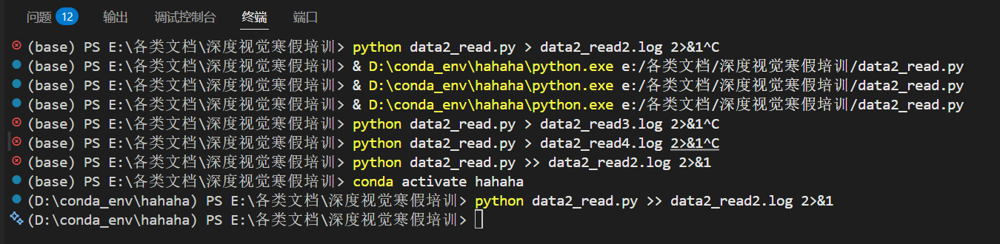  

  后面确认环境的配置确认装了但依旧报错，最终截图问AI，提示是运行时一直用的默认环境，忘记切换环境了。

  **（3）** 神经网络MLP搭建  
  - 单隐藏层，后面发现拟合效果太差改为了双隐藏层。  
  - 激活函数：用的LeakyReLU,后面换用过GELU,反复改用，最后还是选择了LeakyReLU。  
  (给的数据中**x全部为负数，用ReLU会导致梯度消失**，所以没考虑用ReLU)  
  - 损失函数：用的均方误差损失函数MSELoss。
  
   **（4）** 参数调整  
   最初的学习率0.001，隐藏层神经元数128，轮数100，效果太差。  
   后面经过不断得反复调整，当隐藏层神经元数512，隐藏层激活函数为LeakyReLU，学习率5e-4，轮数3000时候，此时拟合效果最好。  

   **（5）可视化对比**  
   在最好的拟合效果的参数下，修改轮数，分别绘制了10、100、1000轮的拟合曲线。  
   可以发现轮数越大，拟合效果越好。  
   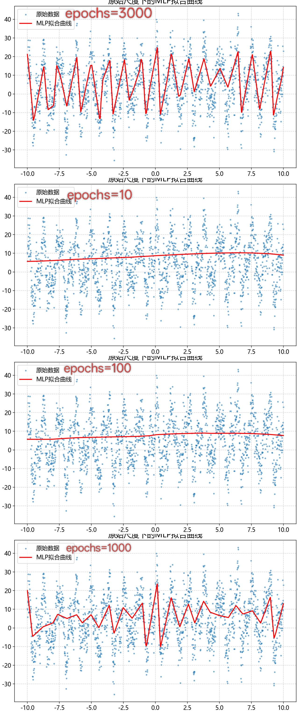  

   **（6）学习率分析**  
   在最好的拟合效果的参数 （**lr=5e-4**）下，修改学习率分别为1.0和0.00001时。  
   - 学习率为**5e-4**时，训练损失逐渐下降，下降趋势越来越小，测试损失同样缓慢下降。训练损失和测试损失渐渐趋同，没有出现梯度爆炸现象。  
   - 学习率为**1.0**时，训练损失出现梯度爆炸现象（在0附近出现尖峰，明显震荡），测试损失也出现梯度爆炸现象（也出现尖峰）。学习率过大，模型参数更新太快，无法收敛。
   - 学习率为**0.00001**时，训练损失和测试损失下降太慢，收敛速度太慢。学习率太小，训练效率低。  
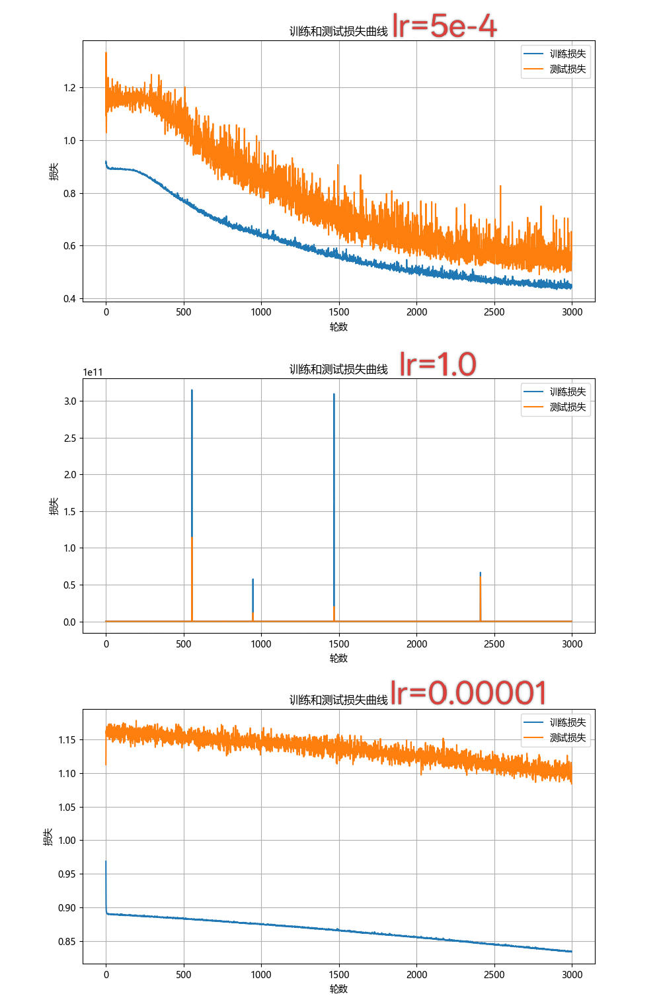  
  
判断方法来源AI提问，链接：
>https://www.doubao.com/thread/w9d0d86da076d56d9  
 
**（7） 过拟合现象判定**  
  暂未发现过拟合情况。
### 2.笔记     
**0.** 缩写表  
<table>
  <thead>
    <tr>
      <th>缩写</th>
      <th>英文全称</th>
      <th>中文含义</th>
      <th>常见场景/示例</th>
    </tr>
  </thead>
  <tbody>
    <tr>
      <td>fc</td>
      <td>Fully Connected Layer</td>
      <td>全连接层</td>
      <td>fc1, fc2, classifier head</td>
    </tr>
    <tr>
      <td>conv</td>
      <td>Convolutional Layer</td>
      <td>卷积层</td>
      <td>conv1, conv2, CNN</td>
    </tr>
    <tr>
      <td>pool</td>
      <td>Pooling Layer</td>
      <td>池化层</td>
      <td>max_pool, average_pool</td>
    </tr>
    <tr>
      <td>relu</td>
      <td>Rectified Linear Unit</td>
      <td>激活函数</td>
      <td>ReLU, ReLU6, leaky ReLU</td>
    </tr>
    <tr>
      <td>bn</td>
      <td>Batch Normalization</td>
      <td>批归一化</td>
      <td>bn1, bn2, 加速训练稳定梯度</td>
    </tr>
    <tr>
      <td>dropout</td>
      <td>Dropout Layer</td>
      <td>随机失活层</td>
      <td>防止过拟合, 分类器前常用</td>
    </tr>
    <tr>
      <td>lstm</td>
      <td>Long Short-Term Memory</td>
      <td>长短期记忆网络</td>
      <td>序列建模, NLP/时间序列</td>
    </tr>
    <tr>
      <td>gru</td>
      <td>Gated Recurrent Unit</td>
      <td>门控循环单元</td>
      <td>轻量版LSTM, 序列建模</td>
    </tr>
    <tr>
      <td>emb</td>
      <td>Embedding Layer</td>
      <td>嵌入层</td>
      <td>NLP词嵌入, 推荐系统特征编码</td>
    </tr>
    <tr>
      <td>attn</td>
      <td>Attention Layer</td>
      <td>注意力层</td>
      <td>Transformer、自注意力机制</td>
    </tr>
    <tr>
      <td>trans</td>
      <td>Transformer Block</td>
      <td>Transformer块</td>
      <td>大语言模型、ViT等骨干结构</td>
    </tr>
    <tr>
      <td>upsample</td>
      <td>Upsampling Layer</td>
      <td>上采样层</td>
      <td>图像生成、语义分割（U-Net）</td>
    </tr>
    <tr>
      <td>concat</td>
      <td>Concatenation Layer</td>
      <td>拼接层</td>
      <td>特征融合, 如U-Net跳跃连接</td>
    </tr>
    <tr>
      <td>softmax</td>
      <td>Softmax Activation</td>
      <td>Softmax激活层</td>
      <td>多分类任务输出</td>
    </tr>
    <tr>
      <td>sigmoid</td>
      <td>Sigmoid Activation</td>
      <td>Sigmoid激活层</td>
      <td>二分类、概率输出</td>
    </tr>
  </tbody>
</table>
  
**1.** TensorDataset和DataLoader的作用  
- TensorDataset：将x_train和y_train转换为张量格式，再组合成数据集  
- DataLoader：将TensorDataset数据集转换为可迭代的批量数据迭代器，方便模型训练。  
  - 按照（ batch_size ）每次取64个样本来拆分数据。
  - 在训练时打乱数据顺序（shuffle = True），避免数据过拟合。每一个迭代周期epoch都会打乱一次顺序。  

**2.** 特征张量（Feature Tensor）和标签张量 （Label Tensor）  
- 特征张量：原始输入数据，包含样本的关键信息。
- 标签张量：样本的目标输出，即样本的真实结果，模型需要学习的正确答案。      
 
**3.** 每次训练时，抽样数量多少合适？  
- 最常用的数量是32，见顾客训练的稳定性和速度。
- 当模型更为复杂时，32可能会超出显存，此时设置为16.
- 当模型简单，显存充足时，选择64。比如浅层神经网络或者线性回归。  

**4.** 隐藏层设置几层合适？  
- 零隐藏层：输入数据明确为线形可分，比如简单的二分类和线性回归问题。
- 单隐藏层：大部分数据为非线性可分的困难分分类或者回归任务都只单个隐藏层。
- 多隐藏层：实际应用场景非常少。      

>参考CSDN文章链接：  
 https://blog.csdn.net/lt77701/article/details/76135962?fromshare=blogdetail&sharetype=blogdetail&sharerId=76135962&sharerefer=PC&sharesource=2402_82991364&sharefrom=from_link  
和AI对话记录链接：  
https://www.doubao.com/thread/w6be1382bafe06812  
 

**5.** 参数设置多少合适？  
隐藏层激活函数和输出层激活函数以及损失函数，首先用最简单最广泛应用的函数，其次根据情况进行更改。  
学习率，轮数，隐藏层神经元数，根据任务复杂程度和数据量调整。  
**6.** 单隐藏层神经元数设置多少合适？  
- 对**神经元数量**的**影响因素**有以下几个：  
  - **任务复杂程度**：任务复杂程度越高，需要的神经元数量越多。  
    - 简单任务：线性分类、简单回归任务等，32-128神经元
    - 复杂任务：图像识别、自然语言生成等，256及以上
  - **输入和输出维度**：神经元数量介于输入维度和输出维度之间。
  - **数据量**：数据量和神经元数量成正相关。
  - **算力限制**：设备的算力大小限制神经元数量上限。  
    
**7.** 标准化和反标准化  
**标准化**：将不同尺度、范围或者单位的数据转换为均值为0，标准差为1的分布，通过减去均值再除以标准差实现。  
- 目的有：
  - 提高模型的训练速度和稳定性。
  - 避免特征之间的量纲差异对模型的影响。使特征之间尺度一致能被同等对待。
  - 使模型对异常值具有鲁棒性（对抗数据误差和输入异常）。  

- 常用：
  - Z-Score标准化：将数据转化为均值0，标准差为1的分布。  
   （该MBL中使用Scikit-learn库的StandardScaler类实现。）  
  - Min-Max标准化：将数据转化为0-1之间的分布。      
    

**反标准化**：将标准化后的数据还原为原始数据分布，通过乘以标准差再加上均值实现。  

>参考知乎文章链接:  
https://zhuanlan.zhihu.com/p/672988109  
与AI对话记录链接：  
https://www.doubao.com/thread/w85a54ab04744fb27  
https://www.doubao.com/thread/w70fefbfb124b8640  
https://www.doubao.com/thread/w4985f3a810f5bd1e  
  
**8.** 梯度下降  
梯度下降为机器学习和深度学习中的优化算法。作用是作为最小化损失函数，通过不断调整参数，找到最优参数。  
- 梯度：损失函数关于参数的偏导数  
- 下降：参数更新的时候，沿梯度反方向调整  
- 分类：
  - **1.** 批量梯度下降（BGD）：每次使用所有样本计算梯度，更新参数。
  - **2.** 随机梯度下降（SGD）：每次随机选择一个样本计算梯度，更新参数。
  - **3.** 小批量梯度下降（mini-BGD）：每次随机选择多个样本（小批量）计算梯度，更新参数。(最常用最主流)   

梯度指向损失函数上升最快的方向，梯度的反方向为损失函数下降最快的方向。  
以参数w为例，梯度下降参数更新的公式为：   
$$
w_{new} = w_{old} - \eta \cdot \frac{\partial L}{\partial w}  
$$  
- $\frac{\partial L}{\partial w} $是损失函数关于参数w的梯度,$\eta$是学习率步长  
- 假如梯度>0为正，参数增加损失上升，则$w_{new}$ =$w_{old}$ - 正数，参数减小，损失函数值下降。  
- 假如梯度<0为负，参数增加损失下降，则$w_{new}$ =$w_{old}$ + 负数，参数增大，损失函数值下降。    
  
当在反向传播时，没经过一层，梯度就会变小，最后的几层梯度几乎为0，而最前面几层完全不更新，此时就为梯度消失问题。
  
**9.** 过拟合和正则化
- 过拟合：模型在训练数据上表现优异，但在未见过的测试数据上表现很差，本质是学到了数据中的噪声而非泛化规律。（模型复杂度过高，数据不足或者有噪声）
- 正则化：防止过拟合、提高泛化能力的技术。  
  
>参考CSDN文章链接  
https://blog.csdn.net/weixin_45733884/article/details/136767926?fromshare=blogdetail&sharetype=blogdetail&sharerId=136767926&sharerefer=PC&sharesource=2402_82991364&sharefrom=from_link

**10.** 归一化  
以CIFAR-10数据集为例，进行归一化处理。  
```Python
transforms.ToTensor(),  #把PIL图像转化为张量Tensor
transforms.Normalize(mean=(0.5, 0.5, 0.5), std=(0.5, 0.5, 0.5))  #归一化  
```  
当函数Totensor()将PIL图像转化为张量Tensor后，函数Normalize()将张量Tensor归一化。  
Normalize利用计算公式：  
- out = (in - mean) / std  

mean:图像三原色的通道均值为0.5。 std:图像三原色的通道标准差为0.5。  
最终效果是将图像三原色的通道值从[0,1]映射到[-1,1]，数据中心移到0。  
作用：  
- 加速模型收敛，使数据分布更加标准，帮助优化算法，能更快得到最优解。  
- 提升模型稳定性，防止过拟合。  

**11.** 反归一化  
与归一化刚好相反，公式：  
- img = img*0.5 + 0.5   

**12.**   
数据预处理（标准化+划分比例）- 数据增强（样本重采样）- 数据加载（批量处理）- 定义神经网络 - 设置超参数 - 训练模型 - 模型预测 - 预测可视化   
```Python
#提取样本
x = df["x"].values
y = df["y"].values
#调整维度
x = x.reshape(2000,-1)
y = y.reshape(2000,-1)
```   
在读取原数据2000个一维样本后，分别将横纵坐标转化为2000行1列的矩阵X和Y  
```Python
scaler_x = StandardScaler()
scaler_y = StandardScaler()
x_train, x_test, y_train, y_test = train_test_split(
    scaler_x.fit_transform(x), scaler_y.fit_transform(y), 
    test_size = 0.2, random_state = 42
)
```  
利用标准化器StandardScaler()对X和Y进行标准化处理,进行Z-score 标准化。  
将标准化后的x和y分别赋值给训练集和测试集，比例8：2  
```Python
#为了增强效果，使用数据增强，将y>0的样本复制一份加入训练集中
mask_pos = (y_train > 0).reshape(-1)
x_pos = x_train[mask_pos]
y_pos = y_train[mask_pos]
#将正样本添加到训练集中
x_train_aug = torch.cat([x_train, x_pos], dim=0)
y_train_aug = torch.cat([y_train, y_pos], dim=0)
```  
采用过采样策略，y>0样本数可能较少，为了提高模型对正样本的识别能力，采用过采样策略，将y>0的样本复制一份加入训练集中。    
> 不是针对x>0的原因：回归任务或者分类任务中，因为数据分布不平衡，所以采用过采样。此类任务中，不平衡指标签y的分布，过采样的对象是少数类样本。x是特征，y是预测目标，y的分布直接影响模型的学习方向，y>0过少，模型很难学到如何准确预测这些样本。增加y>0样本数量，在后面损失函数计算中，样本的梯度贡献被放大，模型更关注对正样本的拟合。
将[-1,1]映射到[0,1]，数据中心恢复到0.5。  

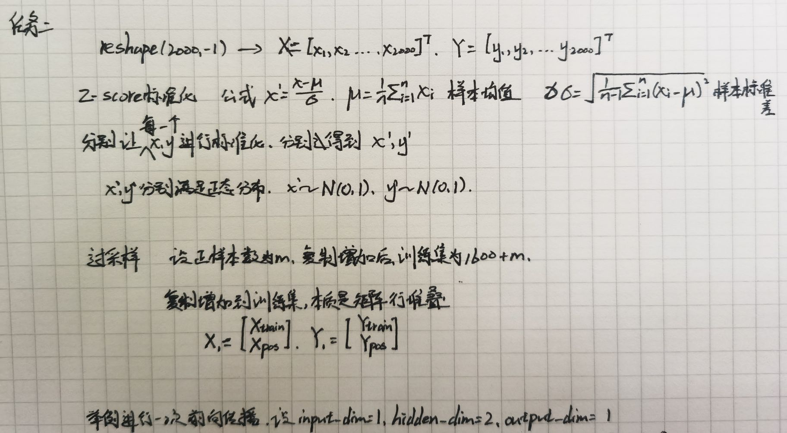
```Python
#创建TensorDataset和DataLoader
train_dataset = TensorDataset(x_train_aug,y_train_aug)
test_dataset = TensorDataset(x_test,y_test)
#这里TensorDataset将x_train和y_train转换为张量格式，再组合成数据集
#x_train是特征张量，y_train是标签张量
train_loader = DataLoader(train_dataset,batch_size = 64,shuffle = True)
test_loader = DataLoader(test_dataset,batch_size = 64,shuffle = False)
```  
train_dataset内部储存特征张量和标签张量，由TensorDataset()函数将x_train_aug和y_train_aug转换为张量格式，再组合成的数据集。
DataLoader()函数在训练时按批次从数据集中批量提取张量，实现批量矩阵计算，每批提取64个样本。    
shuffle = True,在训练时，随机打乱样本顺序，保证每个批次的样本是随机的，避免模型学习到样本的顺序特征。    
```Python
#定义双隐藏层MLP模型
class TwoHiddenMLP(nn.Module):
    def __init__(self,input_dim = 1,hidden_dim = 512,output_dim = 1):
        super().__init__()   #调用父类nn.Module初始化方法。
        self.fc1 = nn.Linear(input_dim,hidden_dim)   #定义隐藏层1中，输入层维度和隐藏层维度
        self.leaky_relu1 = nn.LeakyReLU()
        self.fc2 = nn.Linear(hidden_dim,hidden_dim)
        self.leaky_relu2 = nn.LeakyReLU()
        self.fc3 = nn.Linear(hidden_dim,output_dim)
        
    def forward(self,x):
        #输入层进入隐藏层进行线形变换
        out = self.fc1(x)
        #经过LeakyReLU激活函数
        out = self.leaky_relu1(out)
        out = self.fc2(out)
        out = self.leaky_relu2(out) 
        out = self.fc3(out)
        #输出当前结果
        return out 
```          
**nn.Module**是Pytorch为神经网络模板提供的模板，所有自定义模型，包括MLP、CNN等都必须继承这个类。其主要作用包括：  
- 封装模型参数的管理，参数包括全连接层的权重矩阵W和偏置向量b。  
- 提供前向传播方法forward()，定义模型的计算流程。    
- 无需手写反向传播逻辑，Pytorch会自动根据前向传播计算图，利用链式法则计算梯度，自动处理反向传播。  
- 支持模型的设备迁移（.to(device)）、保存和加载（torch.save()、torch.load()）
  
可视化流程图如下：
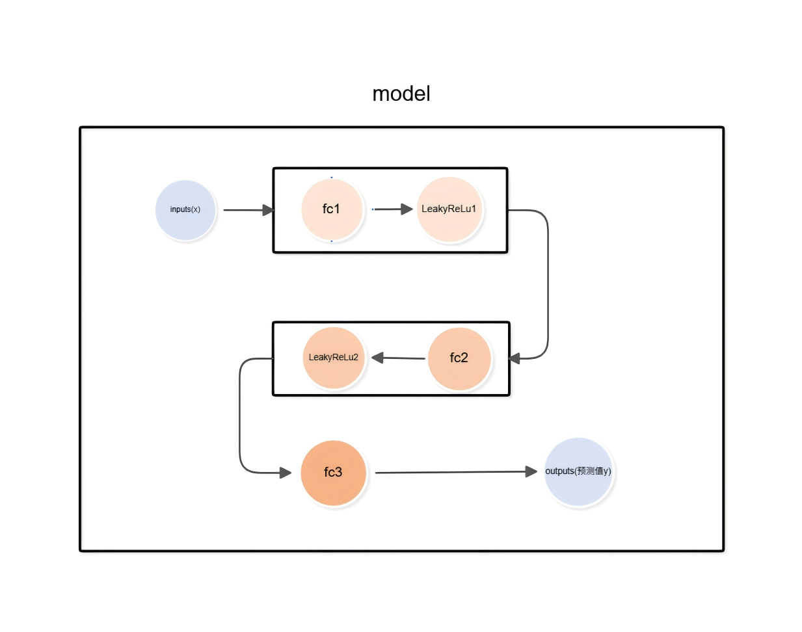  
  
<table>
  <thead>
    <tr>
      <th>层级</th>
      <th>类型</th>
      <th>数学运算</th>
      <th>输入维度</th>
      <th>输出维度</th>
      <th>核心作用</th>
    </tr>
  </thead>
  <tbody>
    <tr>
      <td>输入层<br>$\mathbb{R}^{1}$</td>
      <td>原始输入</td>
      <td>无（仅数据输入）</td>
      <td>$\mathbb{R}^{1}$</td>
      <td>$\mathbb{R}^{1}$</td>
      <td>接收单特征 x</td>
    </tr>
    <tr>
      <td>全连接层 1（fc1）<br>$\mathbb{R}^{512}$</td>
      <td>线性变换</td>
      <td>$z_1 = W_1 x + b_1$</td>
      <td>$\mathbb{R}^{1}$</td>
      <td>$\mathbb{R}^{512}$</td>
      <td>将低维输入映射到高维特征空间</td>
    </tr>
    <tr>
      <td>LeakyReLU1<br>$\mathbb{R}^{512}$</td>
      <td>非线性激活</td>
      <td>$a_1 = \text{LeakyReLU}(z_1)$</td>
      <td>$\mathbb{R}^{512}$</td>
      <td>$\mathbb{R}^{512}$</td>
      <td>引入非线性，拟合复杂关系</td>
    </tr>
    <tr>
      <td>全连接层 2（fc2）<br>$\mathbb{R}^{512}$</td>
      <td>线性变换</td>
      <td>$z_2 = W_2 a_1 + b_2$</td>
      <td>$\mathbb{R}^{512}$</td>
      <td>$\mathbb{R}^{512}$</td>
      <td>对高维特征做进一步线性变换</td>
    </tr>
    <tr>
      <td>LeakyReLU2<br>$\mathbb{R}^{512}$</td>
      <td>非线性激活</td>
      <td>$a_2 = \text{LeakyReLU}(z_2)$</td>
      <td>$\mathbb{R}^{512}$</td>
      <td>$\mathbb{R}^{512}$</td>
      <td>增强模型的非线性拟合能力</td>
    </tr>
    <tr>
      <td>全连接层 3（fc3）<br>$\mathbb{R}^{1}$</td>
      <td>线性变换</td>
      <td>$\hat{y} = W_3 a_2 + b_3$</td>
      <td>$\mathbb{R}^{512}$</td>
      <td>$\mathbb{R}^{1}$</td>
      <td>将高维特征映射回单维预测值</td>
    </tr>
    <tr>
      <td>输出层<br>$\mathbb{R}^{1}$</td>
      <td>模型输出</td>
      <td>无（仅结果输出）</td>
      <td>$\mathbb{R}^{1}$</td>
      <td>$\mathbb{R}^{1}$</td>
      <td>输出 y 的预测值 $\hat{y}$</td>
    </tr>
  </tbody>
</table>
$W$：权重矩阵，$b$：偏置向量，神经元数量=维度。  
隐藏层为全连接层和激活函数的组合，全连接层负责将低维输入映射到高维特征空间，激活函数引入非线性，不改变维度，增强模型的拟合能力。  
第一次输入时的$W$和$b$是Pytorch自动随机初始化的，后面每一次的参数都随梯度下降更新，直到得到最佳值。  

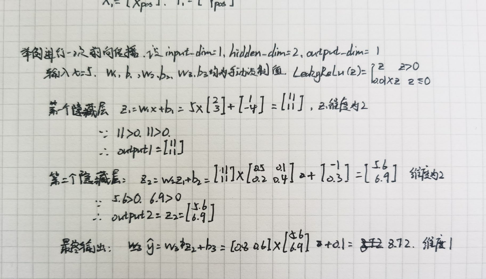    
  
```Python  
#训练循环
for epoch in range(epochs):
    #初始化当前轮次的总损失
    model.train()
    train_loss = 0.0
    for inputs, targets in train_loader:     #内层循环
        optimizer.zero_grad()          #优化器梯度清零，避免与上一轮梯度；累积
        outputs = model(inputs)    #将批次数据传入模型训练，前向传播，计算模型的预测输出
        loss = criterion(outputs, targets)  #利用损失函数计算预测值和标签值的损失
        loss.backward()      #反向传播，计算参数的梯度
        optimizer.step()        #根据梯度更新模型参数
        train_loss += loss.item() * inputs.size(0)  #累计当前批次的损失值，乘以批次大小（nputs.size），得到当前批次的总损失
    #计算每一轮的平均训练损失，总损失除以训练集样本数量
    train_loss_avg = train_loss / len(train_loader.dataset)
    #把平均损失存入列表，以便后续绘图分析
    train_losses.append(train_loss_avg)    
```  
内层循环流程：  

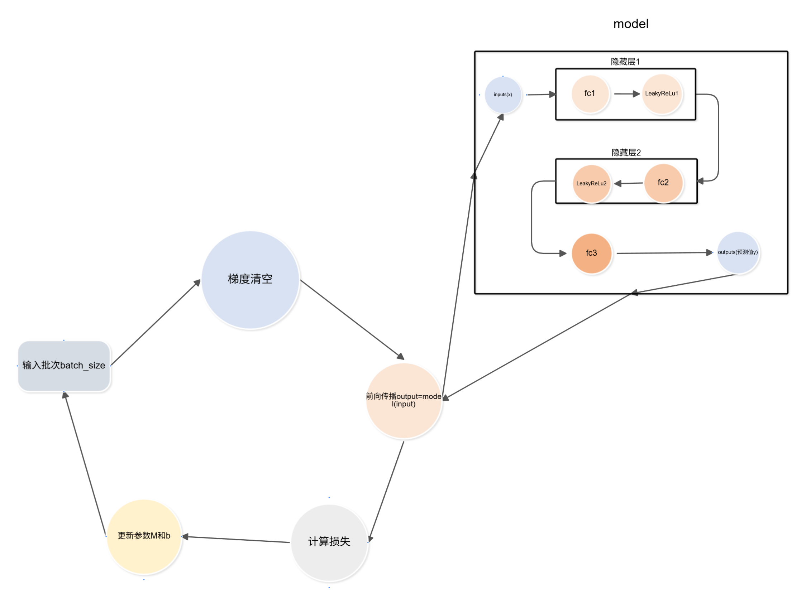

matpolotlib的imshow()函数期望接受的浮点图像数据范围是[0.0,1.0]。为了能正确显示归一化后的图像，需要将图像数据从[-1,1]映射到[0,1]。  


### 3.Bug复盘日志  
-**1** 画图时因字体缺失，以前有遇到过类似情况，换用其他已有字体解决。  
-**2** 在修改构建模型代码时，经常前面部分改了，后面对应部分忘了改，导致运行出错。  
在有的报错看不懂时，截图向AI提问，再解决。  
-**3** 最初拟合效果一直很差，连画了十多二十多次拟合效果都差。向AI提问如何提高拟合度。  
采取部分措施后还是达不到效果，发现一直忽略了学习轮数。在调高学习轮数，对学习率等参数进行对应调整后，得到了最后的好的效果。  

>和Trae对话截图：  
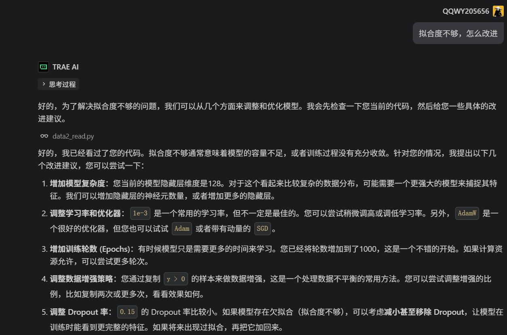  
向豆包提问链接：  
https://www.doubao.com/thread/w58b3cedf3ba0f8c0
  
### 4.AI使用说明  
-**有用**：分析我看不懂的报错内容，给出解决方案。在构建模型时，给出模板代码。解释概念，方便理解学习。  
-**失效**：部分细节识别不了，或者理解不了我的具体问题。有时给出的建议不具有针对性。  
-**如果没有AI**：模型搭建过程会很艰难，尽管能去GitHub、B站等平台寻找教程或类似项目开源代码，但是检索过程会很耗时且不一定能找到。只能去别的相关项目代码里面去寻找照抄需要的代码。  

<hr style="margin-top: 1px; margin-bottom: 1px; border: none; border-top: 1px solid #999;">  

## **任务三：CIFAR-10 图像分类**  
### 1.任务剖析重构  
任务：  
- 及格线：搭建MLP多层感知机模型，进行图像分类，准确率达到50%  
- 进阶线：搭建VGG模型,准确率达到70%。  

过程中记录：  
- 训练日志：包括代码运行日志、损失曲线记录、测试集准确率记录。  
- Debug记录：模型运行中一切问题及解决方法记录。
- 可视化展示：展示分类正确和错误的图片。

### 2.1实现及格线  

**1.模型搭建**  
搭建了一个MLP多层感知机模型来进行图像分类。  
- 藏层一共两层，第一层512个神经元，第二个256个神经元。  
- 激活函数是ReLU函数。两个隐藏层都用的这个激活函数。  
- 损失函数是交叉熵损失函数。  
- 学习率0.01  
- 轮数10轮，每批次64个样本。  
- 优化器为Adam优化器。  
  
这里主要参考了两篇教程文章，链接如下：  
>https://blog.csdn.net/m0_61856412/article/details/141720154?fromshare=blogdetail&sharetype=blogdetail&sharerId=141720154&sharerefer=PC&sharesource=2402_82991364&sharefrom=from_link  

>https://blog.csdn.net/m0_61856412/article/details/141720154?fromshare=blogdetail&sharetype=blogdetail&sharerId=141720154&sharerefer=PC&sharesource=2402_82991364&sharefrom=from_link  
  
  
**2.训练日志**  
截止到2.1.15.14  
准确率**52.87%**，达到及格线。  
损失曲线和测试集准确率曲线如下：
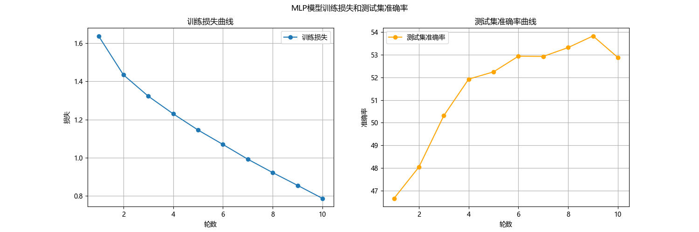
分类结果示例：
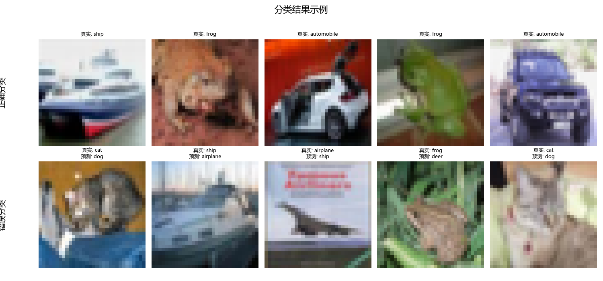   
训练日志文件：**task3_MPL.log** 

**3.其他**  
```Python
#取消密集打印下载进度
class HiddenPrints:  #屏蔽掉后文的所有输出
    def __enter__(self):    #enter：保存原水的标准输出和错误输出，定向到空设备丢弃
        #保存原标准输出和错误输出，以便后续恢复，with板块开始
        #self._original_stdout和self._original_stderr，用实例变量保存，后续需要在exit中恢复
        self._original_stdout = sys.stdout
        self._original_stderr = sys.stderr

        #stdout标准输出，stderr标准错误。
        #os.devnull表示系统的空设备，写入的数据会被丢弃
        #将stdout和stderr指向空设备，丢弃所有输出
        sys.stdout = open(os.devnull, 'w', encoding='utf-8')  #以写入模式（'w'）打开空设备，指定编码utf-8
        sys.stderr = open(os.devnull, 'w', encoding='utf-8')
        

        #with板块结束
    def __exit__(self, exc_type, exc_val, exc_tb):  #exit：关闭定向文件，恢复标准输出和错误输出
        #关闭之前打开的空设备文件，必须关闭，不关闭占用系统文件句柄
        sys.stdout.close()
        sys.stderr.close()
        #恢复原标准输出和错误输出，with板块结束，不恢复后续代码无法打印
        sys.stdout = self._original_stdout
        sys.stderr = self._original_stderr  
```    
HiddenPrints类，属于上下文管理器，用于临时屏蔽后续代码的打印输出。  
- sys.stdout:控制台正常输出通道，所有print()内容默认从该通道输出。  
- sys.stderr:控制台错误输出通道，程序报错、第三方库日志以及数据集下载进度从该通道输出。  
- os.devnull：系统的空设备文件路径，写入的数据会被丢弃。  
    
想要实现输出屏蔽，只需要把sys.stdout和sys.stderr指向os.devnull。  
- exc_type：异常类型，如果with板块没有异常，值为None，如果with块内报错，值为异常类型。  
- exc_val：异常值，错误详情  
- exc_tb：异常跟踪信息，错误发生的位置   
 
在win系统，默认编码是gbk，当输出包含中文或特殊字符时会输出UnicodeEncodeError错误。  所以必须指定encoding='utf-8'。  
每一个open()都会占用一个系统文件句柄，如果打开后不关闭，导致句柄泄露，程序运行久了会报错Too many open files。    

```Python
#搭建模型
class MLP(nn.Module):
    def __init__(self):
        super(MLP,self).__init__()
        self.fc1 = nn.Linear(32*32*3,512)
        self.fc2 = nn.Linear(512,256)
        self.fc3 = nn.Linear(256,10)

    def forward(self,x):
        x = x.view(x.size(0), -1)
        x = torch.relu(self.fc1(x))
        x = torch.relu(self.fc2(x))
        x = self.fc3(x)
        return x
```  
CIFAR10中图片大小为32 * 32 * 3，即3通道，每个通道大小为32 * 32。  
x.size(0) = 64 = batch_size，一次输入64张图片。  
这时候的输入维度为4，即4 * 32 * 32 * 3  
x.view(x.size(0),-1) = x.view(64,-1)  
这里-1的作用是自动计算除batch_size外的维度，即32 * 32 * 3 = 3072  
所以最后x.view = (64,3072)    
全连接层nn.Linear只接受二维输入，第一维是batch_size，第二维是特征维度。  


**4.Debug复盘**   
**（1）** 利用torchvision.datasets下载CIFAR-10数据集时，会不断打印下载进度影响正常的运行日志。  
这里使用上下文管理器，屏蔽了下载进度的打印。  
  
>上下文管理器相关知识参考链接：  
https://blog.csdn.net/m0_72516377/article/details/152120082?fromshare=blogdetail&sharetype=blogdetail&sharerId=152120082&sharerefer=PC&sharesource=2402_82991364&sharefrom=from_link  
https://blog.csdn.net/weixin_45776000/article/details/154988054?fromshare=blogdetail&sharetype=blogdetail&sharerId=154988054&sharerefer=PC&sharesource=2402_82991364&sharefrom=from_link  

### 2.2实现进阶线  
**1. 搭建VGG模型**  
搭建了一个VGG13模型
一共有5个VGG块，5个最大池化层，总共10个卷积层，训练总轮数10轮，学习率0.01。  
模型代码参考：  
>https://blog.csdn.net/qq_53769632/article/details/146952177?fromshare=blogdetail&sharetype=blogdetail&sharerId=146952177&sharerefer=PC&sharesource=2402_82991364&sharefrom=from_link  
 

**2. 训练日志**   
截止到2.2.15.47  
准确率达到**85.81%**   
训练损失曲线和测试集准确率曲线：  
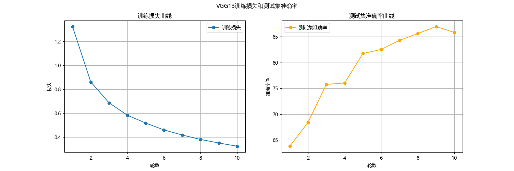
分类结果示例：
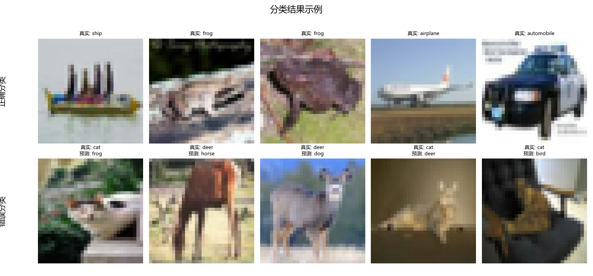   

**3.记录**  
**（1）** VGG块和VGG网络的关系  
VGG块作为VGG网络的核心基础单元，按照固定规律进行堆叠，再搭配全局池化和全连接层组成完整的VGG卷积神经网络。  
VGG块是一个模块化的卷积组合：[卷积层(Conv2d)+激活函数(ReLU)] 重复组合+最大池化层(MaxPool2d)  
- 块内的卷积层：使用3*3的小卷积核，步距1，填充1，保证卷积后特征图的尺寸不变。
- 块末的最大池化层：2*2的池化层，步距2，将特征图的高和宽各减半，实现下采样。
- ReLU：紧跟每个卷积层，引入非线性，提升特征表达能力。  

VGG网络：特征提取部分(完全由VGG块组成)+分类部分（全局池化层+全连接层）  
整个网络的深度由VGG块内的卷积层数量和块的堆叠数量决定。  
（网络深度指卷积层和全连接层数量）  

**（2）** 数据加载时的num_workers参数  
num_workers的设定是用于数据加载的子进程数量。  
- num_workers = 0:等于0为默认值。此时所有的数据加载都在主进程中完成，不用其他子进程。但是当数据量大时，数据准备会很耗时，训练效率会下降。
- num_workers > 0:程序会启动指定数量的独立并行的子进程，负责在后台处理准备数据。主进程负责模型计算，和这些负责数据加载的子进程并行工作。数据准备被加速进行，训练效率会提高。但是如果num_workers设置的过大，也会导致系统资源的浪费。      
  
**（3）** VGG配置字典 
```Python
cfg = {
    'VGG11': [64, 'M', 128, 'M', 256, 256, 'M', 512, 512, 'M', 512, 512, 'M'],
    'VGG13': [64, 64, 'M', 128, 128, 'M', 256, 256, 'M', 512, 512, 'M', 512, 512, 'M'],
    'VGG16': [64, 64, 'M', 128, 128, 'M', 256, 256, 256, 'M', 512, 512, 512, 'M', 512, 512, 512, 'M'],
    'VGG19': [64, 64, 'M', 128, 128, 'M', 256, 256, 256, 256, 'M', 512, 512, 512, 512, 'M', 512, 512, 512, 512, 'M']
}

```  
核心作用：以一种简介、灵活的方式定义不同VGG模型的结构。  
字典中的列表精确描述对应模型包含的卷积层和池化层，以及顺序。  
- 列表中的数字：代表一个卷积层(Conv2d)，数字代表该卷积层输出通道的数量。
- 列表中的'M'：代表一个最大池化层(MaxPool2d)，池化核2*2，步距2，用于降低特征图的空间尺寸。    

利用这个VGG配置字典，相当于有一个通用的VGG类，不用每个VGG模型都写一个单独的类。如果想从VGG13改换到VGG16，直接将创建模型的代码中的VGG13为VGG16即可。  
  
**（4）**   
```Python  
class VGG(nn.Module):
    def __init__(self, vgg_name):
        super(VGG, self).__init__()
        self.features = self._make_layers(cfg[vgg_name])
        self.classifier = nn.Linear(512 * 1 * 1, 10)
```  
  

_make_layers()方法：  
- 根据VGG配置字典，构建整个特征提取部分，卷积层和池化层。    
- 数字元素：创建卷积层，输出通道数为该数字，其他参数默认。  
- 'M'元素：创建最大池化层，默认池化核2*2，步距2。  
  
self.features通过_make_layers()函数，根据vgg_name参数，从字典中读取对应配置，构建卷积层和池化层
self.classifier定义一个全连接层，作为分类器，将输入的512维特征向量映射到10维输出，对应10个类别。  
```Python  
    def forward(self, x):
        out = self.features(x)
        out = out.view(out.size(0), -1)
        out = self.classifier(out)
        return out

```    
输入x，在self.features进行特征提取，得到包括batch_size,channels,height,width的四维张量。  
进入out.view(out.size(0),-1)，将四维特征图展平为二维，进入全连接层self.classifier，进行分类，最终得到分类输出。  
 
```Python  
    def _make_layers(self, cfg):
        layers = []
        in_channels = 3
        for x in cfg:
            if x == 'M':# 如果是M就是池化层
                layers += [nn.MaxPool2d(kernel_size=2, stride=2)]
            else:# 否则是卷积层，每个卷积层跟一个ReLu激活函数(还可以加一个BN层优化)
                layers += [nn.Conv2d(in_channels, x, kernel_size=3, padding=1),
                           nn.BatchNorm2d(x),
                           nn.ReLU(inplace=True)]
                in_channels = x
        layers += [nn.AvgPool2d(kernel_size=1, stride=1)] #可加可不加
        return nn.Sequential(*layers)
```  
定义一个辅助函数_make_layers()来根据字典构建网络层序列  
初始化一个空列表layers，用于存储所有层  
对列表中的每一项进行遍历  
- 如果是M，就在空列表中添加一个MaxPool2d池化层,2*2池化核，步长2，使特征图尺寸减半  
- 如果是代表输出通道数的数字，则依次添加  
   - Conv2d卷积层，使用3*3卷积核，填充padding=1，保持特征图尺寸不变  
   - BatchNorm2d批归一化层，用于加速训练和稳定分布  
   - ReLu激活函数，inplace=True，直接在原内存上操作，节省内存。   

最后可以选择性添加AvgPool2d层，使用1*1核，并不改变尺寸，只是为了适配不同输入尺寸。  
最后返回一个nn.Sequential容器，包含所有层，方便后续调用。  
 
卷积和池化的输出尺寸计算公式(与batch_size无关)：  
$$  
\text{out\_size} = \frac{\text{in\_size} - \text{kernel\_size} + 2 \times \text{padding}}{\text{stride}} + 1
$$   
在输入单样本，忽略偏置的卷积层FLOs公式(多样本就再乘batch_size)：  
$$  
\text{FLOPs} = \text{out\_channels} \times \text{out\_height} \times \text{out\_width} \times \text{kernel\_size}^2 \times \text{in\_channels}  
$$  
在输入单样本，忽略偏置的全连接层FLOPs公式(多样本就再乘batch_size)：  
$$  
\text{FLOPs} = \text{in\_features} \times \text{out\_features}  
$$  
在单样本下的池化层FLOPs公式(多样本就再乘batch_size)：  
$$  
\text{FLOPs} = \text{channels} \times \text{out\_height} \times \text{out\_width} \times \text{kernel\_size}^2  
$$    
> FLOPs:浮点运算次数， 模型算一遍要做多少次计算
  
VGG13模型处理流程：  
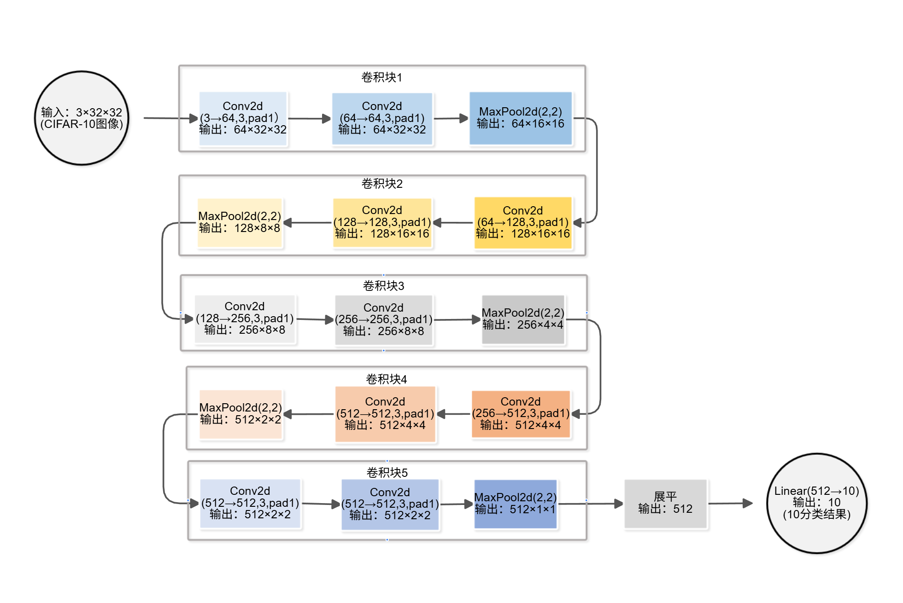  

**4. Debug复盘**  
**（1）** 最初设置数据加载时，**num_workers=2**，才用两个独立子进程，加速数据准备。但是在训练过程中出现了报错(**RuntimeError**),出现了Windows 多进程数据加载时的 **pickle 序列化问题**。
利用
```Python
if __name__ == '__main__':
``` 
来将执行代码封装保护，windows在处理多进程数据加载时，因为spawn启动方式的限制，仍然还是会出现pickle问题:  
- 当num_workers>0时，pytorch的DataLoader会创建新的子进程来并行加载数据。为了创建新的子进程，主进程需要把数据集对象、转换逻辑等所有相关组件通过pickle序列化后再传给子进程。对于windows系统，如果出现任何一个需要传递的对象五法被pickle成功序列化，就会出错。  

最后的解决方法是将数据加载的逻辑完全封装到一个函数中，再到 *if __name__ == '__main__'* 块内调用该函数来创建DataLoader实例。  
```Python
def get_dataloaders(num_workers=2): #定义封装数据加载逻辑的函数
```
```Python
trainloader, testloader = get_dataloaders(num_workers=2) #调用函数
```

### 3.AI使用报告  
-**有用**：在我看不懂运行日志报错内容时，AI分析报错信息，给出解决方案。比如上述RuntimeError问题，提供了后续的解决方法；讲解报错内容背后的原因，和解决方法的原理。  
-**失效**：  
-**如果没有AI**：遇到问题，该问题可能可以在其他平台通过发帖提问或者搜索找到解决办法，也有可能可以采用其他实现路径，避免该问题出现。比如上述pickle序列化问题，可以采用单进程加载避免出现这个问题。  
  
---  

## **任务四：模型调优与深度思考**  
### 进阶线：MLP模型    
  
**学习预热Warmup**：  
-**概念**：机器学习，尤其是深度学习中的一种关键优化策略。引入目的是缓解训练初期因为参数随机初始化、学习率不匹配导致的训练不稳定的问题。通过对模型学习率进行逐步提升或者对模型状态进行调整，使模型高效训练，最终提升收敛速度与模型性能。  
本质是在训练初期动态调整“参数更新强度”。  
-**最常见方式**：逐步增加学习率，从一个极小值学习率开始，每迭代一定步数或者每训练一定轮数，学习率就按比例提升，一直达到预设的学习率，之后进入正常训练阶段，此时学习率要么保持不变，要么衰减下降。  
-**其他方式**：  
- 线形预热（Linear Warmup）：在训练开始时的最初几个轮次，将学习率从一个非常小的值进行线形地、平滑地提升到目标学习率。使模型在训练初期能更稳定地适应数据，避免了因为学习率过高而导致的训练不稳定问题。  
- 余弦预热（Cosine Warmup）：在预热阶段结束后，学习率按照一个余弦函数的曲线平滑地下降。好处是，在训练的大部分时间里，学习率可以维持在一个较高的水平，有助于模型快速地收敛。在训练末期，学习率变小，有助于模型在最优解附近进行微调，找到局部最优解提升准确率。 
- 常数预热（Constant Warmup）。
  
**数据混合增强Mixup：**  
-**概念**：深度学习中的一种经典的样本级数据增强技术。通过对两对样本或者多对样本的特征与标签进行线形插值混合，生成新的虚拟样本。  
-**作用**：扩充训练数据量，让模型学习到样本间的平滑过渡特征。提升模型的泛化能力，缓解过拟合问题。  
-**公式（图像分类中）**：假设训练集中有两个独立的样本对：(x₁, y₁)和(x₂, y₂)，其中x是样本特征（如 224×224×3 的图像张量），y是样本标签（通常为独热编码，如 [1,0,0] 代表类别 1）。用以下步骤生成新样本(x̃, ỹ)：  
- **1.** 从 Beta 分布Beta(α, α)中随机采样一个混合系数λ，其中α>0是超参数。  
  Beta 分布的特性：当α=1时，Beta (1,1) 等价于均匀分布（λ 在 [0,1] 内等概率取值）；当α<1时，λ 更接近 0 或 1（混合更偏向某一个原始样本）；当α>1时，λ 更接近 0.5（混合更均衡）。  

- **2.** 混合特征（x̃）和标签（ỹ）。对两个样本的特征进行线性插值，对两个样本的标签进行线性插值。  
  - x̃ = λ * x₁ + (1 - λ) * x₂  
  - ỹ = λ * y₁ + (1 - λ) * y₂  

- **3.** 用(x̃, ỹ)替换原始样本对(x₁, y₁)和(x₂, y₂)进行训练。  
  

>上述有关Warmup和Mixup的基础知识来自AI讲解，对话链接：
https://www.doubao.com/thread/wa2f068a270e267c7  

---  
**注意：** 在进行Warmup和Mixup前，我对任务三的原始MLP模型进行了计算，  
模型参数量为1.7073 M，计算量为0.0017 G，测试集准确率52.87%。

**第一次修改：**  
加入Mixup数据增强：加入mixup_data和mixup_criterion函数。在训练循环中，调用mixup_data函数对输入数据进行混合增强，调用mixup_criterion函数计算损失。  
加入学习率预热Warmup：每轮增加0.0005，最终学习率为0.001。第1-2轮学习率0.0005，后面都为0.001，训练10轮。  
**运行结果：** 参数量：1.7073 M，计算量：0.0017 G ，测试集准确率53.16%。效果不大。 准确率曲线震荡有点严重。  
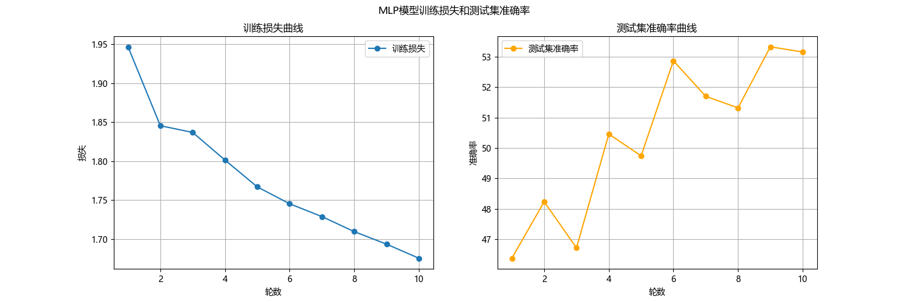 

**第二次修改：**  
调整学习率预热Warmup：  
先线形预热，预热轮数3轮，初始学习率为0.0001，最终学习率为0.001，达到过后开始余弦下降。  
**运行结果：** 参数量：1.7073 M，计算量：0.0017 G，测试集准确率51.98%。反而变为了负面效果。  
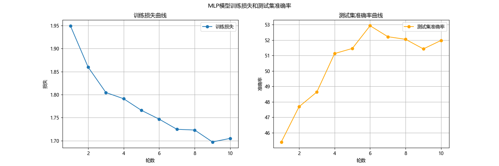  

**第三次修改：**  
把模型简化，将隐藏层维度降低，加入Dropout正则化。  
将隐藏层维度降低可以减少参数量，计算量也会降低。Dropout层在训练时随机暂时关闭一部分神经元的输出，使网络被迫去学习到更分散鲁棒的特征。  
- Dropout层：防止神经网络过拟合的正则化技术。在训练过程中，随机“丢弃”，暂时关闭部分神经元，使其暂时不参与当前批次数据的前向传播和反向传播。在模型测试或者模型推理过程中，被暂时关闭的神经元重新激活，参与正常工作。  
  
**运行结果：** 参数量：0.8209M， 计算量：0.0008G 测试集准确率：50.42%。参数量减少，计算量下降了一半，但是准确率下降了1%。准确率曲线几乎无震荡。 
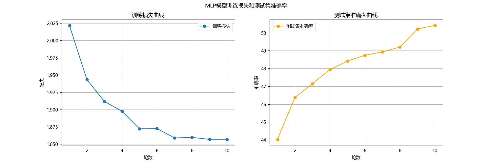   

**第四次修改：**  
增大学习轮数到20轮，3轮预热，17轮退火。  
**运行结果：** 参数量：0.8209M，计算量：0.0008G，测试集准确率：55.75%。准确率显著上升。  
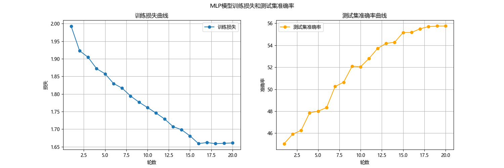  

**第五次修改：**  
继续增加学习轮数，到40轮，5轮预热，35轮退火，最终学习率提高到5e-4。  
**运行结果：** 参数量：0.8209，计算量： 0.0008G，测试集准确率：56.51%。  
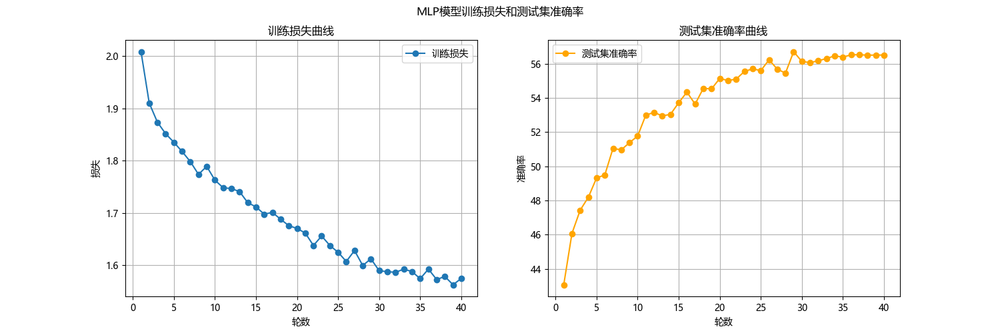  

**第六次修改：**  
这次加入自监督学习预训练，然后在CIFAR10上进行监督微调。  
自监督学习：一种无需人工标注的高效学习范式，让模型从数据本身自动生成监督信号（伪标签），通过解决前置任务来学习数据的通用特征。这些通用特征可以迁移到下游任务中，大幅度降低对标注数据的依赖。  
这里预训练阶段采用旋转预测，监督微调阶段采用交叉熵损失。  
原理：对同一张图片进行旋转等数据增强，得到两个“正样本”，再和其他图像的增强版本（负样本）进行对比，让模型学习正样本对的特征更加相似，负样本对的特征更疏远。  
**运行结果：** 参数量：0.8209M，计算量：0.0008G，测试集准确率：56.99%   
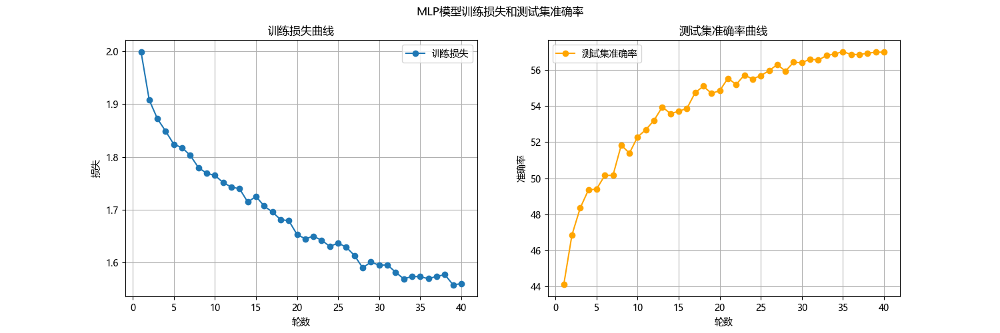 

**第七次修改：**
增加MLP隐藏层层数，提高自监督学习轮数和监督微调总轮数，把Dropout比例从0.3提高到0.5,增强正则化。  
**运行结果：** 参数量：3.6767M ，计算量： 0.0037G，测试集准确率：58.45%。参数量大大增加，训练时长惊人，但是效果甚微。
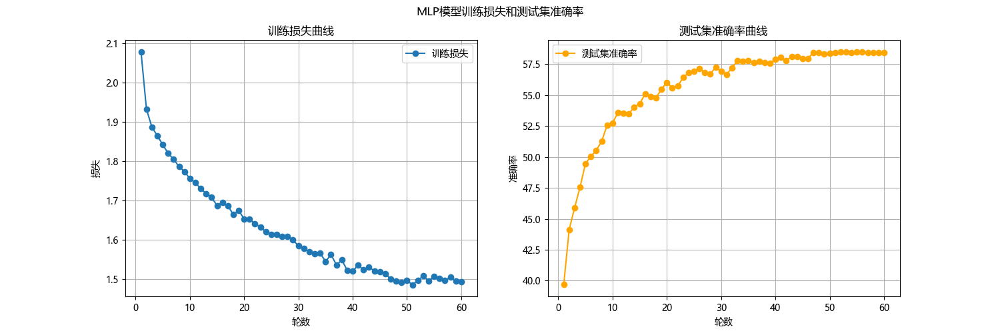  

**第八次修改：**  
降低正则化度，从0.5降到0.4。  
因为根据前几次的准确率曲线，在最后会出现准确率连续多轮未有提高，所以加入早停机制，准确率连续5轮不提高就停止训练。  
改用优化器，从Adam换到AdamW。AdamW和Adam主要是在对权重衰减的处理方式上不同。传统的Adam将权重衰减和梯度更新耦合在一起，有时候就会降低其正则化效果。AdamW则是将权重衰减从梯度更新中解耦，带来更好的泛化性能，帮助模型达到更高的准确率。  
**运行结果：** 参数量：3.6767M，计算量：0.0037G，测试集准确率：55.26%。
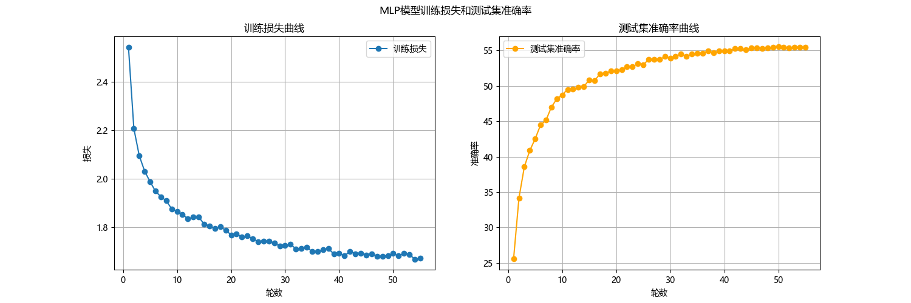    

**第九次修改：**  
继续数据增强，加入随机裁切和随机水平翻转。  
采取批归一化，对每一批的数据进行归一化，显著稳定和加速训练过程。  
计算损失函数时候，引入标签平滑，“软化”真实标签，防止模型对训练数据产生过拟合，提高模型在测试集上的泛化能力  
在数据增强中加入随机擦除，随机在输入图像上擦除一小块区域，使模型关注物体全局特征，提升模型鲁棒性  
**运行结果：** 参数量：3.6798M，计算量：0.0037G，测试集准确率：50.39%。
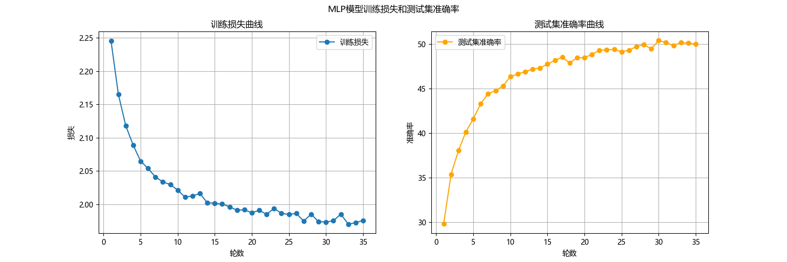   

**第十次修改：**    
加入残差链接，构建更深的网络，也可以避免梯度消失的问题。
**运行结果：** 参数量：73.5253M，计算量：0.0736G，测试集准确率：51.66%。
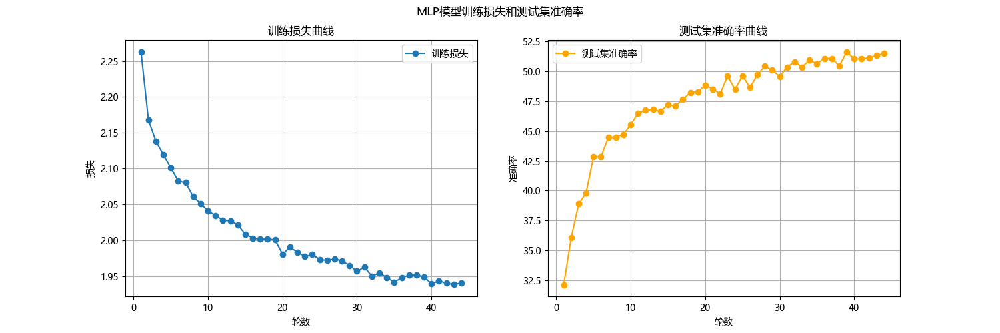  
  
---
#### 对前十次修改及造成的影响的分析：  
**第一次：**  
加入MixUp数据增强，混合输入和标签，提高模型的泛化能力。但是因为此MLP模型比较简单，所以效果不是很显著。  
加入学习率预热，因为训练轮数太少，学习率动态调整没有完全发挥作用，效果不佳，而且准确率曲线震荡严重。  
**第二次：**  
学习率先线形预热，再余弦下降。这种调整方式更适合深层网络，对浅层网络MLP，在预热阶段，低学习率限制了模型初期收敛速度，而余弦下降又过早降低了学习率，导致模型出现欠拟合的情况。  
**第三次：**  
降低隐藏层维度使得模型的拟合能力下降，而且加入Dropout正则化进行过拟合的抑制，加剧了模型的欠拟合问题。但是准确率曲线变得更加平滑，说明过拟合有被抑制。  
**第四次：**  
增加模型训练轮数，从10轮到20轮，调整学习率预热。增加训练轮数使模型有更多的机会学习到数据的特征，提高了模型的泛化能力，加上学习率预热的适当调整，模型准确率得到明显提升。  
**第五次：**  
继续增加训练轮数，调整学习率预热。使得模型在训练后期仍有足够的优化动力，避免模型过早收敛到局部最优解。但是准确率提升不显著，说明仍有问题（可能是模型过拟合，或当下模型架构的性能瓶颈）。  
**第六次：**  
加入自监督学习预训练。使模型在CIFAR10上学习到通用特征，然后在监督微调阶段，模型可以更快地收敛到最优解，提高了模型的准确率。但是浅层MLP网络不能有效利用到自监督学习学到的复杂特征，所以准确率提升有限。  
**第七次：**  
增加隐藏层层数，Dropout比例增加。模型表达能力增加，过拟合被进一步抑制。但是参数数量暴增，训练时间延长，训练成本提高，但是准确率提升不明显。  
**第八次：**    
加入了早停机制，模型可能在还未完全收敛时就提起终止训练。Dropout比例降低，正则化效果减弱，模型过拟合风险增加。两者使得准确率下降。  
**第九次：**  
加入图片随机裁剪，旋转的数据增强手段。批归一化、标签平滑和随机擦除。两者使模型泛化能力增强，但是对深层MLP的根本问题没有改善，准确率反而下降。  
**第十次：**  
加入残差连接，模型网络变得更深，网络深度急剧增加，训练时长暴涨，模型复杂程度远超分类任务需求。出现严重过拟合问题和优化问题。
  
**总结：**  
起正面效果修改：  
- 增加训练轮数，隐藏层层数。  
- Mixup数据增强。  
- 加入自监督预训练。  

起负面效果修改：  
- 学习率预热、余弦退火。  
- 降低隐藏层维度、Dropout比例。  
- 引入批归一化，标签平滑，随机擦除。  
- 改用优化器AdamW。  
- 加入残差连接构建更深的网络。  

---  

**第十一次修改：**  
去除起负面效果的修改：  
- 学习率预热、余弦退火。    
- 引入批归一化，标签平滑，随机擦除。  
- 放弃优化器AdamW，改用优化器Adam。  
- 加入残差连接构建更深的网络。  

**运行结果：** 参数量：8.9216M，计算量：0.0089G，测试集准确率：47.46%。  
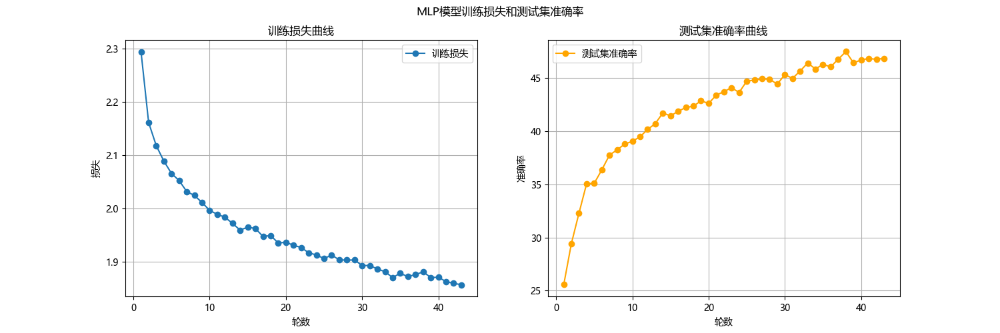    
  
**第十二次修改：**  
调整MLP模型，从3072-2048-1024-512-256改为3072-1024-512-256，模型参数量下降，训练速度会上升，过拟合风险下降。学习率提高到3e-4。  
**运行结果：** 参数量：1.7389M，计算量：0.0017G，测试集准确率：47.59%。准确率曲线震荡严重。  
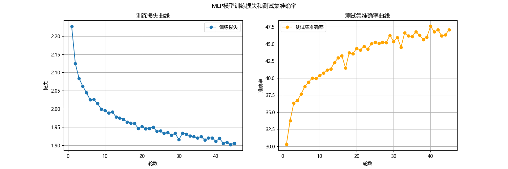    


  

**第十二次修改：**    
以任务三MLP模型为基础，重写模型，重新进行调整。  
- 采用输入压缩，原本是直接将CIFAR10的3*32*32的图片展平，现在先用一个1*1的卷积核将输入维度降到2维，再展平。这样保留了图像的空间信息，同时减少了参数数量。  
```Python
self.input_compress = nn.Sequential(
    nn.Conv2d(3, 2, kernel_size=1, stride=1, padding=0),  # 3→2通道，比3→1更保留信息
    nn.BatchNorm2d(2),
    nn.LeakyReLU(negative_slope=0.1, inplace=True)
```  
- 加入残差连接，使模型更深，表达能力更强，也避免了梯度消失问题。
- 加入批归一化，BN层，加速模型收敛
- 将Dropout正则化比例从0.5降低到0.2，在防止过拟合的同时，不会丢失过多的信息。
- 换用激活函数，从ReLU改为LeakyReLU，避免死亡ReLU问题。
  - 死亡ReLu问题，指输入小于等于0时，输出为0，导致梯度也为0，模型参数无法更新。

- 继续采用数据增强，随机水平翻转、裁切，标签混合。 
```Python
transforms.RandomCrop(32, padding=4), 
transforms.RandomHorizontalFlip(p=0.5),

for inputs, labels in loader:
    inputs, labels = inputs.to(device), labels.to(device)
    #Mixup数据增强
    inputs, y_a, y_b, lam = mixup_data(inputs, labels, mixup_alpha, device.type=="cuda")
```
- 加入标签平滑。在损失函数中加入，防止模型在训练时对标签过度自信，输出绝对的0或1，导致模型过拟合。
```Python
    #初始化模型
    model = MLP().to(device)
    #损失函数，标签平滑
    criterion = nn.CrossEntropyLoss(label_smoothing=0.05)
```
- 优化器换用为SGD，开启Nesterov动量。  

**运行结果：**
参数量：0.432 M，计算量：0.0004 G，准确率：53.06%，运行时长：9min34s
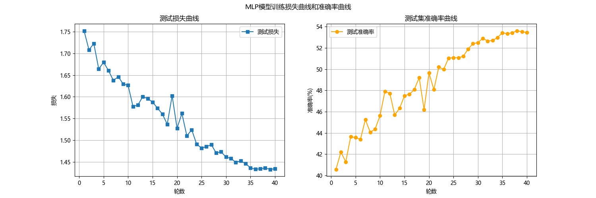
   

### 进阶线：VGG模型  
**注意：**  
优化前最后一次运行结果：    
参数量：9.42 M，计算量：0.23 G，测试集准确率：84.18%。  
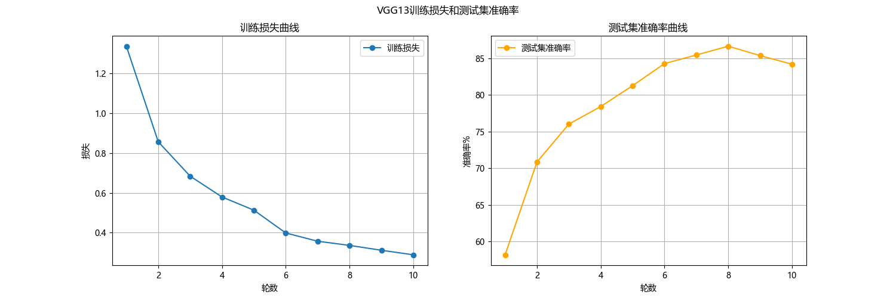  
  
**第一次修改：**  
加入Mixup数据增强，随机水平翻转、裁切，标签混合。  
加入Dropout正则化，p = 0.5。  
加入早停机制，连续3轮学习率无提升就停止训练。  
在卷积层后加入BN层，进行批归一化，提高模型的收敛速度和泛化能力。  
增加训练轮数到20轮。  
**运行结果：** 参数量：9.68 M，计算量：0.23 G，测试集准确率: 87.61%,运行时长：7min10s。  
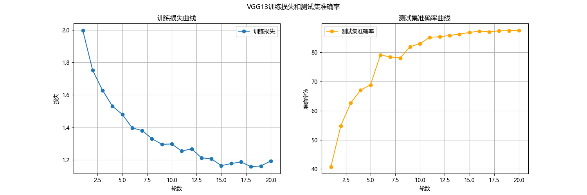    

  
**第二次修改：**  
调整卷积核尺寸，从3 * 3改为1 * 1 + 3 * 3，减少计算量，保持相同的感受野。  
- 先加入瓶颈层，1*1的卷积层将输入通道数减少到瓶颈通道数。
- 后空间卷积，用一个3*3的卷积层保持输出特征图尺寸不变,且将通道数恢复到原始输出维度。     
**运行结果：**参数量：3.28 M，计算量：0.09 G，测试集准确率: 84.03%,运行时长：7min17s。    
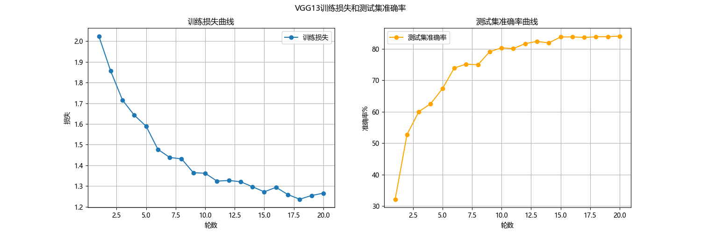  

**第三次修改：**  
全局平均池化（GAP）替代全连接层：去掉最后的三层全连接，用nn.AdaptiveAvgPool2d(1)将卷积输出直接映射为类别数。  
**运行结果：**参数量：3.28 M，计算量：0.09 G，测试集准确率: 84.63%,运行时长：13min21s。   
运行时长几乎翻倍，准确率几乎没有提升。推测可能是瓶颈式卷积结构1*1 + 3*3的影响。全局平均池化提升了模型的泛化能力，但是瓶颈式卷积结构造成了额外卷积层数和内存消耗。  

**第四次修改：**  
去掉瓶颈式卷积结构，只保留3*3卷积层。  
**运行结果：** 参数量：9.68 M，计算量：0.23 G，测试集准确率: 88.42%,运行时长：7min10s。  
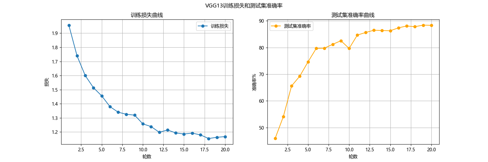  

**第五次修改：**  
用深度可分离卷积将标准卷积分为深度卷积(depthwise)和逐点卷积(pointwise)，将卷积层轻量化，减少计算量和参数量。  
比将VGG13中重复的如 2个3*3卷积+ReLU模块 替换为 1个深度卷积+1个逐点卷积+BN+ReLU模块。  
在卷积组后添加Squeeze-and-Excitation模块，通过全局池化学习通道权重，自适应增强重要特征，提升模型准确率。  
**第一次运行结果：** 参数量：1.16 M，计算量：0.03 G，测试集准确率: 80.87%,运行时长：7min29s.  
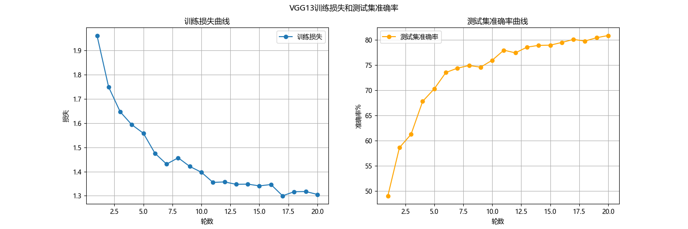

**第二次运行结果：** 参数量：1.16 M，计算量：0.03 G，测试集准确率: 78.92%,运行时长：22min49s  
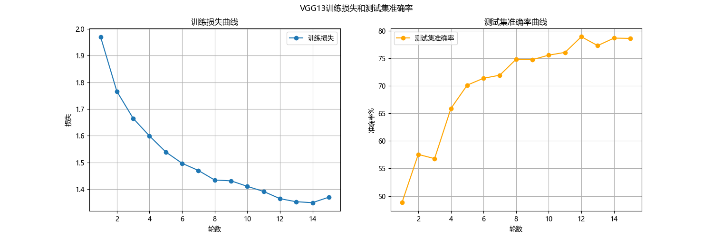  

**第六次修改：**   
将SE模块放到深度可分离卷积后，让通道注意力更精细。  
将StepLR学习率调度换掉，加入余弦退火学习率，让模型在后期更稳定收敛。  
**运行结果：** 参数量：1.24 M，计算量：0.03 G，测试集准确率: 81.66%,运行时长：7min58s.    
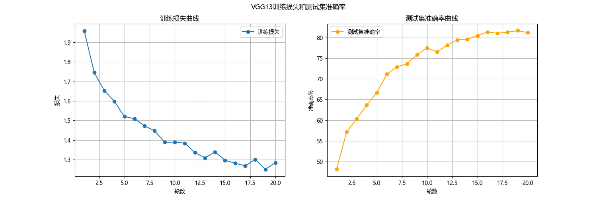  

**第七次修改：**  
加入Warnup学习率预热，前5轮进行预热,学习率预热到0.1，再进行余弦退火。  
优化器从Adm更换到SGD  
在classifier中加入一个512*512的隐藏层和一个ReLU激活函数，增强正则化。  
**运行结果：** 参数量：1.5 M，计算量：0.03 G，测试集准确率: 86.92%,运行时长：7min58s.    
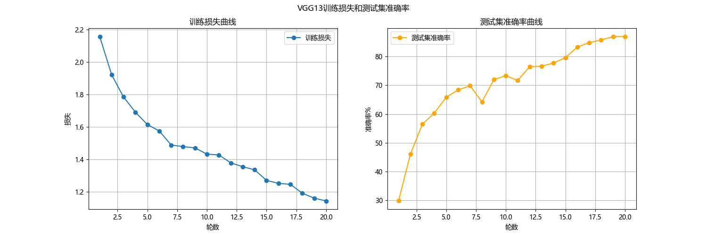  

准确率、参数量和计算量变化图：    
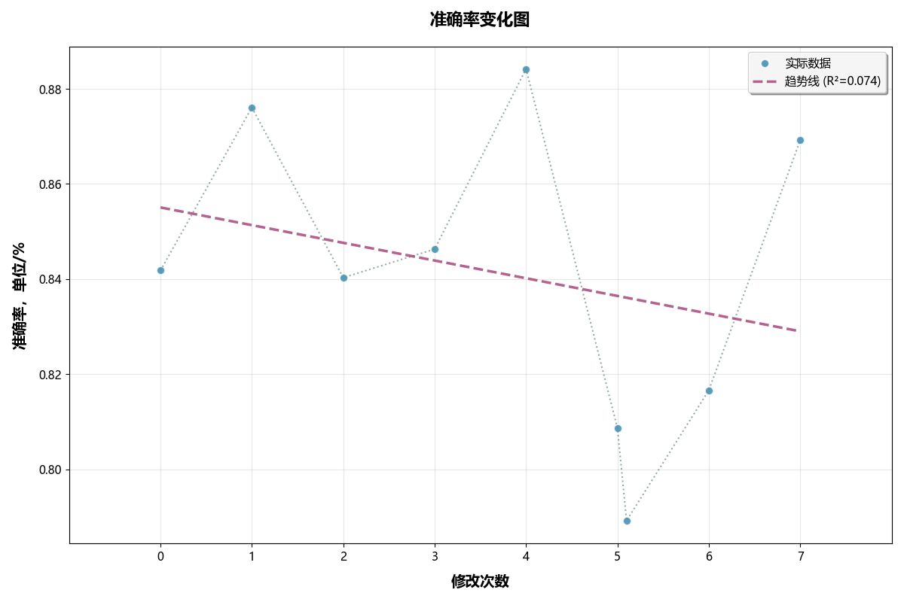        
        
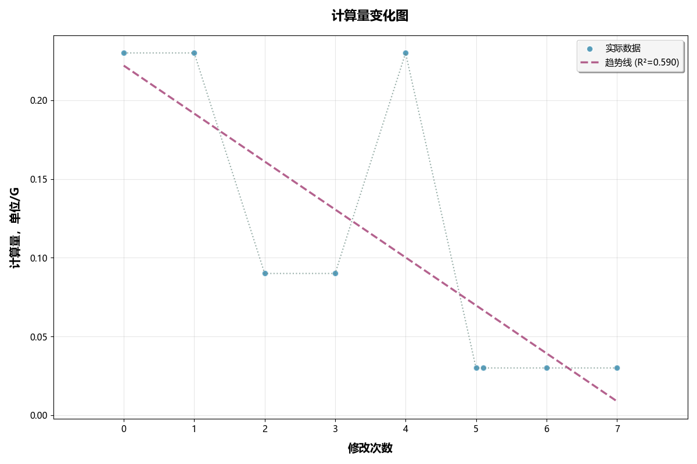
  
**分析：**  
在**第四次**修改后，准确率达到了最高值**88.42%**。同时，参数量和计算量分别也达到了最大值，分别为**9.68 M和0.23 G**。  
但是，在**第七次修改**后，准确率也达到了**86.92%**，参数量和计算量分别为**1.5 M和0.03 G**。与第四次修改相比，准确率减少了**1.5%**，参数量下降了**84%**，计算量下降了**87%**。牺牲了一点准确率，但是参数量和计算量大大减少，模型更加轻量化。

### AI使用说明   
#### AI有效：  
在完成任务过程中，使用AI了解概念和方法、生成模板代码，解释看不懂的报错内容。  
#### AI失效：  
提供错误或不存在的下载链接。比如生成不存在的库的版本下载链接，最后是自己去官网找的对应版本下载链接。  
对代码进行调试时给出方法不对。因为代码水平低下，AI帮助也不起作用的话，几乎陷入死局。 

---
## **任务五：实例分割**  
### 实现过程记录：  

最早想尝试用Mask-RCNN模型实现任务    
>参考知乎文章：  
Pytorch-Mask-RCNN-行人分割实战 - Ctrl CV的文章 - 知乎  
https://zhuanlan.zhihu.com/p/596574457    

决定对该项目进行复现改进，达到任务要求。  
但是一直遇到代码调试问题，自己和AI都无法解决，暂且放弃该方法。   
（运行日志当时被我删了，找不到记录了）   

后又打算直接用YOLOv8实现实例分割任务，但是在对模型训练完后、对模型开始进行评估时后出现报错：  
AssertionError: Results do not correspond to current coco set​  
原因是我给的评估器的预测结果与评估器内部储存的基准数据集的图像ID不匹配。  
经过长时间修改调试后依旧无法解决，于是该方案暂时也放弃。  
>参考项目：  
https://blog.csdn.net/FriendshipTang/article/details/131987249?fromshare=blogdetail&sharetype=blogdetail&sharerId=131987249&sharerefer=PC&sharesource=2402_82991364&sharefrom=from_link  
  
截止我开始用百度飞桨的Paddlex来实现任务，在模型训练过程中遇到导入的问题：  
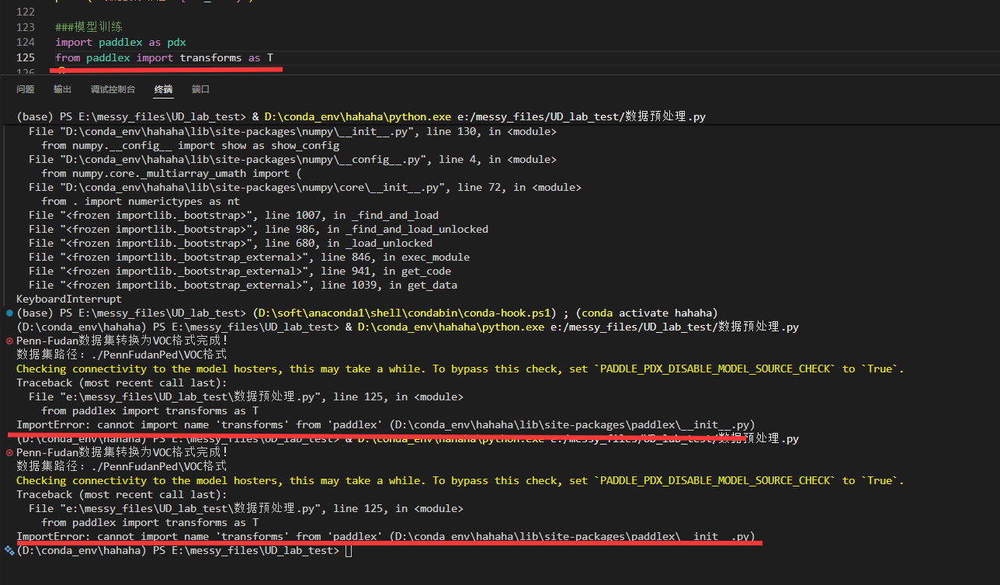
在尝试换用不同导入代码后依旧无果，并在知乎发帖提问，但是一直没得到答复。  
  
等待答复期间我重新调用部署YOLOv8-seg模型,重新做训练代码和预测代码，这次比较顺利，没遇见难题，任务要求得到实现。  
  
### 其他    
```Python
import numpy as np
from PIL import Image
```
```Python
#读取并转化掩码
mask = Image.open(mask_path)
mask_np = np.array(mask) 
```  
Image.open()是PIL库打开图像文件并创建Image对象，建立与图像文件的连接，open方法是PIL库中Image类的核心函数
np.array()是NumPy库中的函数，用于将读取到的图像对象转换为NumPy数组，将像素数据转换为可计算数组，方便后续的数值计算和处理。  
mask_np是一个二维数组，二值掩码，每个元素表示对应像素的类别ID。  
``` Python
coords = np.column_stack(np.where(mask_np > 0))
if len(coords) == 0:
        return []  
  
#从矩阵中分离坐标
y_coords, x_coords = coords[:, 0], coords[:, 1]

#计算降采样步长，最多保留50个点
step = max(1, len(x_coords) // 50)  
x_coords = x_coords[::step] / img_width
y_coords = y_coords[::step] / img_height
```  

mask_np > 0,生成布尔数组，其中所有非零数组位置为True，其他位置为False。  
np.where(mask_np > 0)，返回两个一维数组 (row_indices, col_indices)，分别是所有非零像素的行索引和列索引  
np.column_stack()，将两个一维数组 (row_indices, col_indices) 按列堆叠，生成一个二维数组coords，每一行是一个像素的坐标 (y, x)。这个二维数组实际是一个矩阵（N,2）,N是非零像素的数量,2是，每一个坐标xy。   
在NumPy中，ndarray是矩阵的数值载体，NumPy二维数组相当于可编程的矩阵  
在Python数值计算中，二维ndarray是矩阵。  

在计算降采样步长中。len(x_coords)表示非零像素总和，也表示坐标数记为N。  
N//50表示向下取整，最多保留50个点。  
step = max(1, N // 50),采样步长等于这个最大值，步长至少要为1。  

x_coords[::step]和y_coords[::step]表示每隔步长取一个像素横纵坐标，得到一个新的矩阵，行数约为N//step。  
用降采样后的坐标进行归一化，核心公式是：[像素坐标//图像尺寸]，x//img_width, y//img_height，把坐标从[0,img_width - 1]和[0,img_height - 1]映射到[0,1]和[0,1]。  

进行归一化的原因：  
YOLO模型在训练时候，不用图像绝对的像素尺寸，需要所有坐标都为相对坐标，相对于图像宽/高的比例表示坐标，范围在[0,1]。  
如果不进行归一化，模型需要适配不同尺寸图像的绝对像素值，训练难度增加，也有可能无法收敛    

```Python
#拼接为YOLO格式的点字符串
contour_points = [f"{x:.6f} {y:.6f}" for x, y in zip(x_coords, y_coords)]
return contour_points
```    
zip(x_coords, y_coords)将归一化后的xy坐标一一配对，比如：  
x_coords = [0.1, 0.2, 0.3]  
y_coords = [0.4, 0.5, 0.6]  
zip(x_coords, y_coords) → ((0.1, 0.4), (0.2, 0.5), (0.3, 0.6))  
f"{x:.6f} {y:.6f}" for……，遍历每一个坐标，并将其格式化，把浮点数转化为保留6位小数的字符串。并且用空格隔开（YOLO标签文件中坐标的标准格式）。  
最终返回字符串列表contour_points，其中每一个元素表示多边形的一个顶点，可以直接写入YOLO模型的.txt标签文件。  
总的计算过程：  
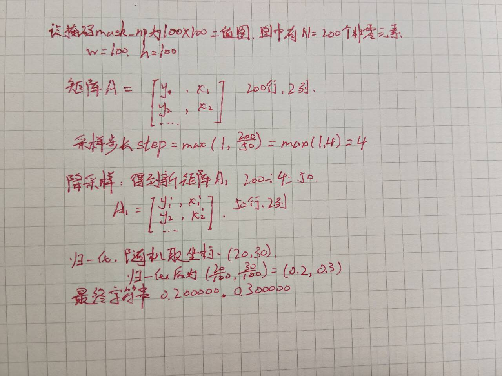  

```Python
    if raw_data_dir.exists():
        print("已下载数据集，跳过下载")
    else:
        print("没有下载数据集，开始自动下载保存。")
        exit(1)   #终止程序运行并返回状态码
```  
exit()为Python内置函数，作用为立即终止当前程序的执行，退出解释器  
参数为退出状态码，表示程序退出原因。0表示无错误正常退出，非零值表示有错误异常退出，不同数字表示不同错误。1代表文件不存在，2代表参数错误。   

### 最终结果输出：    
数据集中的图进行预测
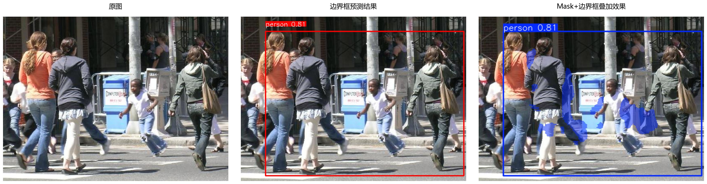  
小红书上找的网图进行预测
    

### AI使用说明  
#### AI有效：  
在完成任务过程中，使用AI了解概念和方法、获取预训练模型、配置文件下载链接，生成模板代码，解释看不懂的报错内容。  
#### AI失效：  
提供错误或不存在的下载链接。比如生成不存在的peddlex版本下载链接，最后是自己去官网找的对应版本下载链接。  
对代码进行调试时给出方法不对。因为代码水平低下，AI帮助也不起作用的话，几乎陷入死局。    

#### 如果没有AI  
如果没有AI的话这个任务可能会非常吃力，我可能会直接先去复现别人已经做出来的结果，其中一些模型部署和调试会非常困难。而且我去发帖或是询问周围人任务过程中出现问题的解决办法，可能发的贴会石沉大海，或者得不到合理正确的回答。  

---
    
