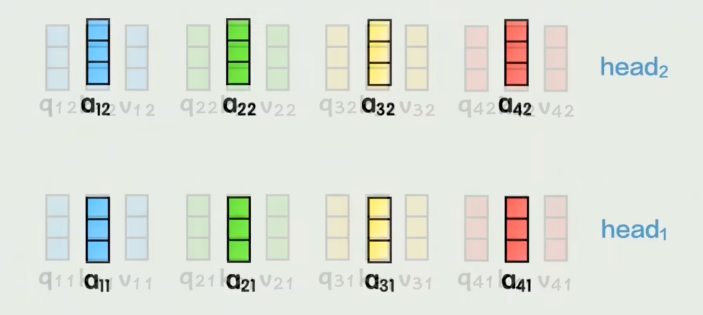
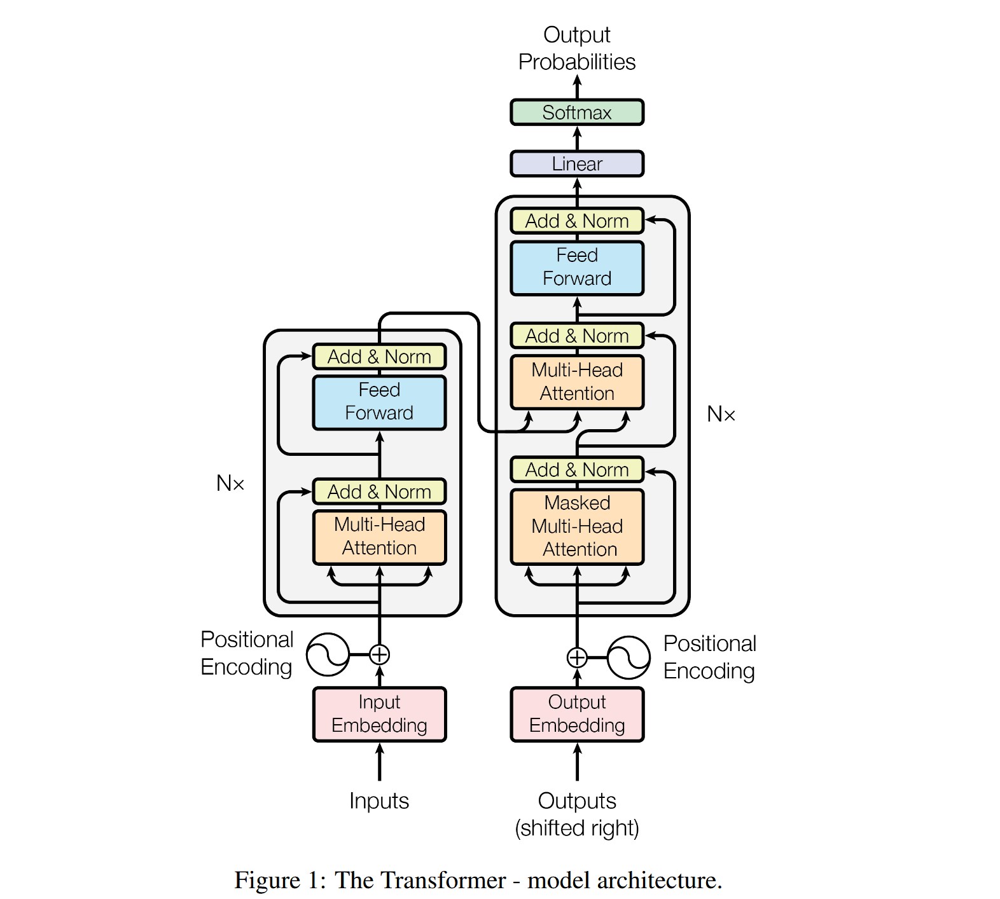
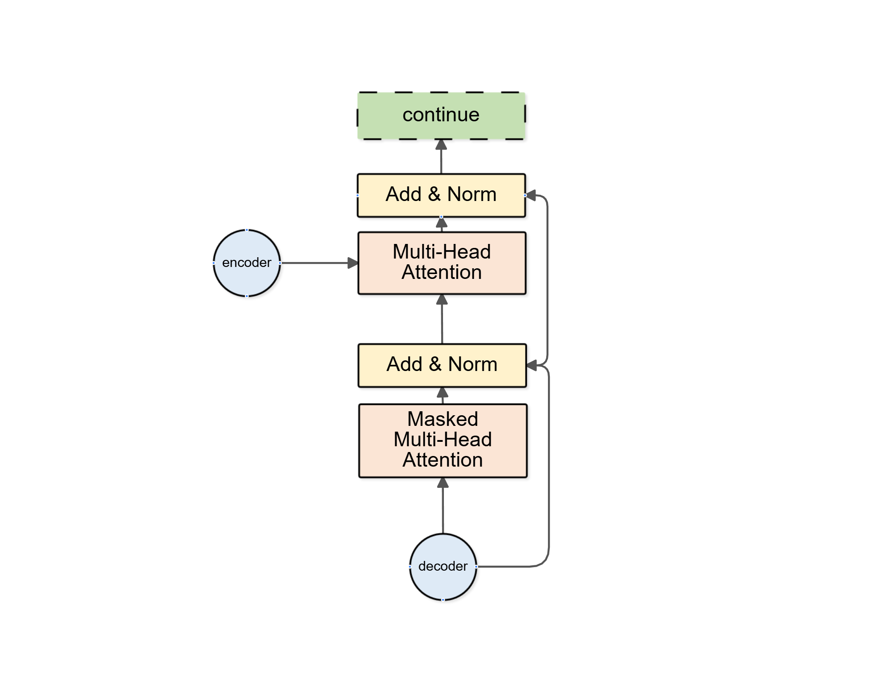

# Attention is all you need阅读笔记[^1] 
---    
## 前言   
该论文提出Transformer模型时是为了解决翻译问题，由于没有相关背景知识储备，读着比较困难。
  
---  
## 解决的问题     
传统的RNN神经循环模型的核心计算逻辑是时序依赖的串行计算，第t步的隐藏状态必须根据第t-1步的隐藏状态和当前的输入来计算才能得到，无法跳过前序步骤直接计算后续状态。  
串行计算会带来两个问题：  
 - 1.在训练时，多个样本组成一个批次进行并行计算，但如果为长序列，由于需要储存各时间步的隐藏状态，单个样本将占据大量内存，导致批次大小受限，训练效率降低。  
 - 2.同一个样本的不同时间步无法进行并行计算。比如GPU的并行计算能力无法在单样本的序列上发挥作用。  
    
本文基于自注意力机制，设计了一种新的简单神经网络模型Transformer，能够进行全序列并行计算，解决了传统RNN模型的两个问题，取代了传统循环模型。  
  
---  
## self-attention机制和RNN的主要区别    
- RNN本身是按序列顺序迭代计算的循环结构，但是Transformer没有循环和卷积层    
- RNN本身是按顺序处理序列的，天然知道先后关系。  
但是Transformer得核心为自注意力机制，并行处理所有位置的关系，天然没有顺序概念。  
所以在输入时要加入位置编码，Transformer使用正弦位置编码，可以给每个位置生成唯一的向量，该向量包含该位置在序列中的顺序信息。再将这个位置向量与词嵌入向量相加，作为模型输入。   

---  
## 关于transformer的并行的体现   
- 每个attention，每个头可以并行运算  
- 在每个自注意力机制中，每一个token计算注意力权重也是并行进行的。  

---  
## 其他      

---
**注意力机制（*Attention Mechanism*）：**  
深度学习中一种使模型在处理序列数据时能够动态聚焦输入中最相关部分的技术，全局信息查询   
通过模拟人类注意力的工作原理，对输入的每个元素分配一个权重，在对这些元素进行加权求和后得到聚焦后的表示。  
并且，注意力机制可以进行并行计算，直接进行任意两个位置之间的关系，实现全序列并行计算，超越了RNN的串行计算。  

这里引用一个例子[^2]：    
假设，我们现在有这样一个以人名为key（键），以年龄为value（值）的数据库：  
```Python  
{
    张三: 18,
    张三: 20,
    李四: 22,
    张伟: 19
}
```  
现在，我们有一个query（查询），问所有叫“张三”的人的年龄平均值是多少。让我们写程序的话，我们会把字符串“张三”和所有key做比较，找出所有“张三”的value，把这些年龄值相加，取一个平均数。这个平均数是(18+20)/2=19。  

但是，很多时候，我们的查询并不是那么明确。比如，我们可能想查询一下所有姓张的人的年龄平均值。这次，我们不是去比较key == 张三,而是比较key[0] == 张。这个平均数应该是(18+20+19)/3=19。  

或许，我们的查询会更模糊一点，模糊到无法用简单的判断语句来完成。因此，最通用的方法是，把query和key各建模成一个向量。之后，对query和key之间算一个相似度（比如向量内积），以这个相似度为权重，算value的加权和。这样，不管多么抽象的查询，我们都可以把query, key建模成向量，用向量相似度代替查询的判断语句，用加权和代替直接取值再求平均值。**注意力**其实指的就是这里的权重。

把这种新方法套入刚刚那个例子里。我们先把所有key建模成向量，可能可以得到这样的一个新数据库：
```Python  
{
    [1, 2, 0]: 18, # 张三
    [1, 2, 0]: 20, # 张三 
    [0, 0, 2]: 22, # 李四
    [1, 4, 0]: 19 # 张伟 
}
```    
向量中不同位置不同值代表不同信息，比如身高体重职业。  
假设key[0]==1表示姓张。我们的查询“所有姓张的人的年龄平均值”就可以表示成向量[1, 0, 0]。  
（第0位是1：表示我们要匹配姓张这个特征，第1、2位是0：表示我们不关心身高，职业等其他特征  

用这个query和所有key进行内积，算出的相似度、即权重是：  
```Python    
dot([1, 0, 0], [1, 2, 0]) = 1    
dot([1, 0, 0], [1, 2, 0]) = 1
dot([1, 0, 0], [0, 0, 2]) = 0
dot([1, 0, 0], [1, 4, 0]) = 1  
# 内积结果变成是否姓张的判断，1表示是，0表示否
```  
之后，我们该用这些权重算平均值了。注意，算平均值时，权重的和应该是1。因此，我们可以用softmax把这些权重归一化一下，再算value的加权和。  
```Python  
softmax([1, 1, 0, 1]) = [1/3, 1/3, 0, 1/3]
dot([1/3, 1/3, 0, 1/3], [18, 20, 22, 19]) = 19    
```  
这样，我们就用向量运算代替了判断语句，完成了数据库的全局信息查询。那三个1/3权重，就是query对每个key的**注意力**。  
>参考引用自:
https://zhuanlan.zhihu.com/p/569527564  
  
---
**自注意力机制（*Self-Attention Mechanism*）：**   
  
为注意力机制的一种变体，能够将序列中的每个元素都能与序列中所有其他元素建立联系，不再对序列进行顺序处理。  
并行计算：所有位置的注意力分数可以同时计算，极大提升了训练效率。  
捕捉长距离依赖：不会因序列长度增加而丢失信息。  

计算过程：  
输入一个$x^{<i>}$ ，表示序列中的第i个元素,会通过线性变换得到对应的查询向量Query $q^{<i>}$、键向量Key $k^{<i>}$和值向量Value $v^{<i>}$。  
$$  
q^{<i>} = W_Q x^{<i>}, \quad k^{<i>} = W_K x^{<i>}, \quad v^{<i>} = W_V x^{<i>}  
$$  
  
对于输入的某个字，比如问，假设得到对应的查询向量$q^{<2>}$，除此之外还有其他所有位置的key K = ${k^{<i>}}$ 和 value V = ${v^{<i>}}$。    
用当前的$q^{<2>}$，计算和所有$k^{<i>}$的内积，得到相似度分数：  
$$
s_i = q^{<3>} \cdot k^{<i>}, \quad i = 1, 2, 3, 4, 5
$$    
再对所有的$s_i$进行softmax归一化，得到注意力权重$\alpha^{<i>}$：  
$$  
\alpha_i = \text{softmax}(s_i) = \frac{\exp(s_i)}{\sum_j \exp(s_j)} = \frac{\exp(q^{<3>} \cdot k^{<i>})}{\sum_j \exp(q^{<3>} \cdot k^{<j>})}  
$$  
用归一化后的权重$\alpha^{<i>}$，对所有的$v^{<i>}$计算加权和得到输出向量$A^{<3>}$：  
$$
A^{<3>} = \sum_i \alpha_i v^{<i>} = \sum_i \frac{\exp(q^{<3>} \cdot k^{<i>})}{\sum_j \exp(q^{<3>} \cdot k^{<j>})} v^{<i>}
$$  
  
扩展到所有位置，即一次性计算所有输入Q和所有K的相似度（内积），直接使用矩阵乘法：  
$$
Q = \begin{bmatrix}
q^{<1>}_1 & q^{<1>}_2 & \dots & q^{<1>}_{d_k} \\
q^{<2>}_1 & q^{<2>}_2 & \dots & q^{<2>}_{d_k} \\
\vdots & \vdots & \ddots & \vdots \\
q^{<n>}_1 & q^{<n>}_2 & \dots & q^{<n>}_{d_k}
\end{bmatrix}  
$$  

$$
K = \begin{bmatrix}
k^{<1>}_1 & k^{<1>}_2 & \dots & k^{<1>}_{d_k} \\
k^{<2>}_1 & k^{<2>}_2 & \dots & k^{<2>}_{d_k} \\
\vdots & \vdots & \ddots & \vdots \\
k^{<n>}_1 & k^{<n>}_2 & \dots & k^{<n>}_{d_k}
\end{bmatrix}
$$
$$
QK^T = \begin{bmatrix}
q^{<1>} \cdot k^{<1>} & q^{<1>} \cdot k^{<2>} & \dots & q^{<1>} \cdot k^{<n>} \\
q^{<2>} \cdot k^{<1>} & q^{<2>} \cdot k^{<2>} & \dots & q^{<2>} \cdot k^{<n>} \\
\vdots & \vdots & \ddots & \vdots \\
q^{<n>} \cdot k^{<1>} & q^{<n>} \cdot k^{<2>} & \dots & q^{<n>} \cdot k^{<n>}
\end{bmatrix}
$$    

其中每一行对应一个Q与所有K的内积相似度分数，共n行。    
为了防止点积结果过大导致softmax函数输出饱和，通常会对$QK^T$进行缩放，即除以一个缩放因子$\sqrt{d_k}$：  
$$
\frac{QK^T}{\sqrt{d_k}}
$$    
- 这个为注意力分数矩阵
  
此后再对每一行做softmax归一化，得到注意力权重矩阵后，再用它乘以矩阵V，对V进行加权和，得到输出矩阵A：    
$$
\text{Attention}(Q, K, V) = \text{softmax}\left(\frac{QK^T}{\sqrt{d_k}}\right) V
$$      
- 这个输出矩阵A就是多头注意力矩阵中的一个头  

通过让一句话中的每个单词去向其他单词查询信息，我们能为每一个单词生成一个更有意义的向量表示。  
  
>图1[^3]    
  
---
**多头注意力机制（*Multi-Head Attention Mechanism*）：**  
自注意力机制中，每个单词的Q、K、V都是从该单词的词嵌入通过不同的线性变换得到的：  
$$
\begin{cases}
Q = E W^Q \\
K = E W^K \\
V = E W^V
\end{cases}
$$  
- E为输入序列的词嵌入矩阵，每一行代表一个词的词向量，形状为n * $d_{\text{model}}$,n为句子长度， $d_{\text{model}}$为词向量维度。
- $W^Q, W^K, W^V$为学习到的权重矩阵，用于将词向量映射到查询、键、值空间。形状分别为$d_{\text{model}} \times d_q, d_{\text{model}} \times d_k, d_{\text{model}} \times d_v$。  
  在模型训练过程中，通过反向传播和梯度下降自动更新学习到的。
- $d_k$为键向量维度，$d_v$为值向量维度。通常设置$d_k = d_v = d_{\text{model}} / h$，其中h为头数（*head number*）。    
  
与卷积层用多个卷积核提取多通道特征类似，多头注意力使用多组不同的$W^{Q}$, $W^{K}$, $W^{V}$来生成多组自注意力结果，每个头都有自己的查询、键、值空间。  

对第i个头，Q、K、V的线性变换分别为：  
$$
\begin{cases}
Q^i = E W^Q_i \\
K^i = E W^K_i \\
V^i = E W^V_i
\end{cases}
$$      
此后用自注意力公式计算注意力：  
$$
Attention(Q, K, V) = softmax\left(\frac{QK^T}{\sqrt{d_k}}\right)V 
$$  
将所有头的注意力结果拼接起来，拼接后的维度为$d_{\text{model}}$。    
拼接后的向量通过另一个可学习参数矩阵$W^O$进行线性变换，形状为$d_{\text{model}} \times d_{\text{model}}$，得到最后的多头注意力输出：  
$$
MultiHeadSelfAttention(E) = Concat(head_1, \dots, head_h) W^O
$$
  
---
**模型架构**  
     
> 图2[^4]
  
**编码器层（*Encoder*）：**（左侧）  
1.input经过embedding层，将每个单词映射到一个向量表示。  
1. 每个向量表示再加上位置编码，得到最终的输入向量。  
2. 经过多头注意力机制，将输入向量映射到一个新的向量表示。  
3. 进行Add&Norm操作，将注意力输出与输入向量相加，再进行层归一化。  
4. 经过Feed Forward层。  
5. 输出作为下一层的输入。  

**解码器层（*Decoder*）：**（右侧）  
1.左侧输出作为输入，进入Masked Multi-Head Self-Attention  
2. 进行Add&Norm操作，将注意力输出与输入向量相加，再进行层归一化。  
3. 与编码器层的输出进行Multi-Head Attention，得到注意力输出。    
4. 进行Add&Norm操作。  
5. 经过Feed Forward层。  
6. 再次进行Add&Norm操作。  
7. 输出作为下一层的输入。    
   
---
**残差连接和归一化：**  
Transformer模型中，使用了残差连接：  
设模型输入x进入多头注意力模块，得到输出Atten(x)，再进行残差连接得到Atten(x) + x，再进入前馈神经网络Feed Forward层，得到输出FFN(x)。此后再次进行残差连接，得到FFN(x) + (Atten(x) + x)，再进行层归一化。  

残差连接过程主要是为了缓解梯度消失问题：  
设一个残差块的输出为：$y = x + F(x)$    
其中x是输入，F(x)是通过多头注意力机制和前馈神经网络得到的输出。  
在反向传播时，梯度为    
$$
\frac{\partial L}{\partial x} = \frac{\partial L}{\partial y} \cdot \frac{\partial y}{\partial x} = \frac{\partial L}{\partial y} \cdot \left(1 + \frac{\partial F(x)}{\partial x}\right)
$$
- 此时的1来自残差连接的短路路径，使梯度至少有$\frac{\partial L}{\partial y}$，避免了梯度消失  
- 即使$\frac{\partial F(x)}{\partial y}$很小，梯度也不会消失  


同时也可以保留原始信息：  
残差连接的核心是学习残差，而不是直接学习从x到y的映射。但是当F(x)学习到的信息很少甚至是0时，残差块的输出y = x + 0 = 0，此时相当于一个恒等映射，原始输入x的信息被完整保留。
  
残差连接后，进行层归一化($\text{LayerNorm}(x + F(x))$) :  
公式：  
$$
\text{LayerNorm}(x) = \gamma \cdot \frac{x - \mu}{\sigma} + \beta
$$    
- $\gamma$和$\beta$是可学习的参数，用于缩放和平移归一化后的输出。  
- $\mu$和$\sigma$是输入x的均值和标准差。  

残差连接+层归一化流程：  
$$  
x + \text{Sublayer}(x)  
$$

$$
\text{LayerNorm}\bigl(x + \text{Sublayer}(x)\bigr)
$$   
  
---
**前馈网络（*Feed Forward Network, FFN*）：**  
前馈网络是一个全连接的神经网络，包含两个线性层和位于线性层中间的一个ReLU激活函数。  
主要用于对每个位置的向量进行独立的非线性变换，以此捕捉更复杂的特征。  
当注意力层对序列中不同位置的依赖关系进行建模后，前馈层继续对每个位置的特征进行深度加工。  
设残差连接和归一化后输出$x_1$,$x_1$进入前馈网络：  
$$
\text{FFN}(out) = \text{FFN}(x_1) = \max(0, x_1W_1 + b_1)W_2 + b_2 
$$  
- $W_1$和$W_2$是可学习的参数，用于对输入进行线性变换。  
- $b_1$和$b_2$是可学习的参数，用于偏置项。  
- $W_1$和$b_1$为第一个线性层，$W_2$和$b_2$为第二个线性层的。
- $\max(0, \cdot)$为ReLU激活函数，用于引入非线性变换。  
    
---
**解码器右移目标序列进行输入：**  
**1.** 右移概念：  
假设目标输出序列是：$Y = [y_1,y_2,y_3,\dots,y_{t+1}]$  
右移一位（shifted right）:  
- 在最前面加上一个特殊的起始标记 $<sos>$（start of sequence）  
- 去掉最后一个$y_{t+1}$  

得到右移后的目标输出序列：$Y_{\text{shifted right}} = [<sos>, y_1, y_2, \dots, y_t]$  

**2.** 右移原因及作用：  
解码器在**训练时**，使用已知的、正确的目标序列（即翻译后的句子，翻译的标准答案），经过右移处理后，作为解码器的输入。让模型每一步都基于正确的前一个单词进行预测，避免早期预测错误影响后续训练，从而保证训练的稳定性和收敛速度。  
解码器在**推理预测时**，采用自回归生成的方式。初始输入为$<sos>$，模型根据当前输入预测下一个单词，将预测结果作为下一个时间步的输入，直到生成结束标记$<eos>$。    
>这也造成了一个问题，推理时完全依赖模型自身的输出，是一个串行生成的过程，因此会产生较多的冗余计算。      
  
---
**掩码自注意力+多头注意力：**  
在解码器输入中，先进入掩码自注意力层，然后与编码器输出一起进入多头注意力层。  
        
>图三[^5] 

第一层，掩码自注意力层（Masked Multi-Head Attention）：  
- 解码器在生成句子时，不能偷看答案，看到后面的词。所以利用掩码自注意力层，将未来的信息屏蔽起来，只关注当前位置之前的信息。    
- 这一层的Q、K、V来自于解码器自己  

第二层，多头注意力层（Multi-Head Attention）：    
- 这一层的Q来源于解码器，K和V来源于编码器。  
- 每一个解码器输出单词都会与每一个编码器的输入单词求一个注意力，以找到每一个解码器输出单词最相关的某几个编码器输入单词。Q是输出单词，K、V是输入单词。 
- 简单理解：编码器给到原文“我吃鸡蛋”，解码器已经翻译出“I eat”，询问编码器对应到原文的哪里了，编码器回答“吃”，于是解码器继续翻译接下来的“鸡蛋”。

mask掩码计算：  
掩码的作用是使解码器生成第$i$个单词时，只能关注到第$i$个单词之前的信息，而不能关注到第$i$个单词之后的信息。计算第$i$行输出时，只能用第$i$列信息，强制把后面列的信息屏蔽。  
原始的自注意力公式：  
$$
Attention(Q, K, V) = softmax\left(\frac{QK^T}{\sqrt{d_k}}\right)V   
$$  
其中注意力分数矩阵为$\frac{QK^T}{\sqrt{d_k}}$，记为S   
掩码矩阵是一个下三角矩阵：  
$$
M = 
\begin{pmatrix}
0 & -\infty & -\infty & \dots & -\infty \\
0 & 0 & -\infty & \dots & -\infty \\
0 & 0 & 0 & \dots & -\infty \\
\vdots & \vdots & \vdots & \ddots & \vdots \\
0 & 0 & 0 & 0 & 0
\end{pmatrix}
$$
加掩码的就是S+M：  
$$
S_{\text{masked}} = \frac{QK^\top}{\sqrt{d_k}} + M
$$  
其中，下三角：$S + 0 = S$，不变。  上三角：$S + -\infty = -\infty$，被屏蔽。   
之后做对每一行进行softmax归一化，对每一个$x_i$：  
$$
\text{softmax}(x_i) = \frac{e^{x_i}}{\sum_j e^{x_j}}
$$   
于是对$S_{\text{masked}}$进行归一化，下三角可以继续正常运算，但是上三角$e^{-\infty} \rightarrow 0$  
完整掩码注意力公式就为：  
$$
\text{MaskedAttention}(Q, K, V) = \text{softmax}\left( \frac{QK^\top}{\sqrt{d_k}} + M \right) V
$$    
最终第$i$列之后的信息全部计算为0，保证解码器只能从左到右按顺序生成，不能偷看未来位置。

---

**自然语言处理（*Natural Language Processing, NLP*）：**  
人工智能和语言学交叉的一个重要领域。  
使计算机能理解处理和生成人类语言。  
在Transformer提出之前，主要基于循环神经网络RNN和卷积神经网络CNN来进行序列处理。但在自注意力机制提出，Transformer模型成为其主流架构。  
**生成的顺序性：**  
传统的生成式模型，比如RNN，是按照序列顺序生成的，通常为自回归式，每个时间步的输出依赖于之前的时间步。  
**长短期记忆网络（*Long Short-Term Memory, LSTM*）：**  
为循环神经网络RNN的一种改进变体。设计目的是为解决传统RNN在处理长序列时出现的梯度消失或梯度爆炸问题。  
通过引入设计的门控机制，使网络有选择地保留或遗忘信息，以此在较长的时间步上维持关键信息。  
**门控循环单元（*Gated Recurrent Unit，GRU*）：**  
是LSTM的一种简化版本，也用于处理序列数据。旨在保持LSTM性能的同时，降低模型复杂度。      
## 引用  
[^1]: Vaswani A, Shazeer N, Parmar N, et al. Attention is all you need[C]//Advances in Neural Information Processing Systems. Curran Associates, Inc., 2017: 5998-6008.  
[^2]:这个例子引用自：https://zhuanlan.zhihu.com/p/569527564
[^3]:来源https://www.zhihu.com/pin/2005730424467519213  
[^4]:来源《Attention Is All You Need》  Figure 1  
[^5]:自己画的

